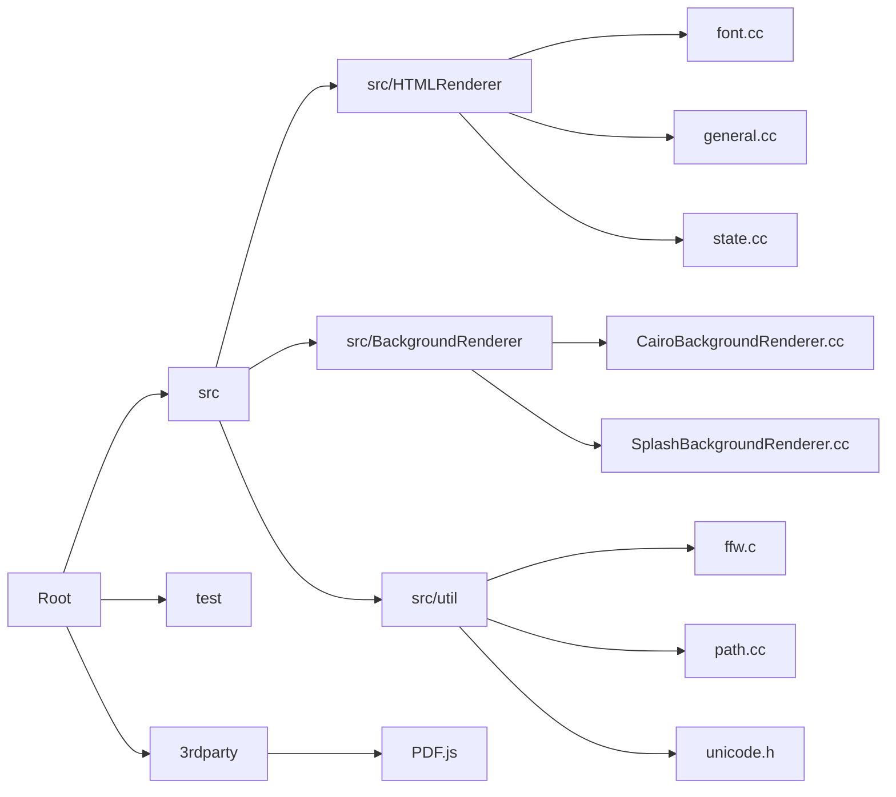

# Code Structure Documentation: pdf2htmlEX pdf2htmlEX

## Executive Summary
The codebase is a medium-sized C/C++ project (Total Files: 74, LOC: 12,908) designed to convert PDF documents into HTML. The architecture is modularized into distinct subsystems, primarily separating the concerns of HTML DOM generation, background image rendering, and core utility functions. The project relies heavily on C++ (30%) and C (28%), with supporting scripts in Python and HTML for testing and browser compatibility.

The codebase is organized around a central `src` directory, with specific sub-modules for rendering engines (`HTMLRenderer`, `BackgroundRenderer`) and shared utilities (`util`). The architecture follows a layered approach, distinguishing between orchestration logic, presentation rendering, and shared utilities.

## Technology Stack
Based on the detected code analysis:

*   **Primary Languages:** C++, C
*   **Secondary Languages:** HTML, Python, JavaScript
*   **Key Libraries & Dependencies (from code analysis):**
    *   **PDF.js:** Used for underlying PDF processing and browser compatibility (polyfills).
    *   **Cairo:** Backend for SVG rendering.
    *   **Splash:** Backend for PNG/JPG bitmap rendering.
    *   **FontForge:** Used for font processing (via a C-wrapper).

## Architecture Overview

The system is structured into four primary layers:

1.  **Orchestration Layer:** Contains the main entry points and pipeline coordination.
2.  **Presentation Layer:** Split into two engines:
    *   **HTML Rendering Engine:** Converts PDF structures to semantic HTML.
    *   **Background Rendering Engine:** Handles visual fidelity via image/canvas generation.
3.  **Shared Layer:** Provides common utilities (filesystem, unicode, geometry) used across the application.
4.  **External Layer:** Manages third-party integrations and vendor code.

### Directory Structure
The file organization reflects the modular subsystems:

## Subsystem Responsibilities

### 1. Main Application Logic (Orchestration)
*   **Location:** `src/` (Root level files)
*   **Key Files:** `src/pdf2htmlEX.cc`, `src/Preprocessor.cc`, `src/Param.h`
*   **Responsibilities:**
    *   Acts as the primary entry point and orchestrator for the rendering pipeline.
    *   Handles command-line argument parsing and global parameter management.
    *   Performs PDF preprocessing to scan font usage and page dimensions.
    *   Manages the generation and optimization of HTML text lines.
    *   Provides utility functions for Base64 encoding and temporary file cleanup.

### 2. HTML Rendering Engine (Presentation)
*   **Location:** `src/HTMLRenderer/`
*   **Key Files:** `src/HTMLRenderer/general.cc`, `src/HTMLRenderer/font.cc`, `src/HTMLTextLine.cc`
*   **Responsibilities:**
    *   Converts PDF content structures (text streams, images, vector paths) into semantic HTML DOM elements.
    *   Interprets and tracks PDF graphics state (transformations, fonts, colors, clipping paths).
    *   Extracts embedded fonts (TrueType, OpenType, Type1) and dumps them to external files.
    *   Renders interactive elements like hyperlinks and form widgets.
    *   Tracks PDF state changes in `state.cc` to determine when new HTML elements are required.

### 3. Background Rendering Engine (Presentation)
*   **Location:** `src/BackgroundRenderer/`
*   **Key Files:** `src/BackgroundRenderer/CairoBackgroundRenderer.cc`, `src/BackgroundRenderer/SplashBackgroundRenderer.cc`
*   **Responsibilities:**
    *   Renders PDF page backgrounds to preserve visual fidelity using Canvas or image generation.
    *   Supports multiple backends: Cairo (for SVG) and Splash (for PNG/JPG).
    *   Manages the embedding of generated images into the HTML stream (external files or Base64).
    *   Handles rendering fallbacks (e.g., switching from SVG to bitmap if complexity exceeds limits).

### 4. Core Utilities (Shared)
*   **Location:** `src/util/`
*   **Key Files:** `src/util/ffw.c`, `src/util/path.cc`, `src/util/unicode.h`, `src/ArgParser.cc`
*   **Responsibilities:**
    *   **Filesystem:** Path manipulation, creation, sanitization, and parsing.
    *   **Text Processing:** Unicode mapping, validation, and encoding (HTML/JSON/UTF-8).
    *   **Geometry:** Matrix transformations and bounding box intersection calculations.
    *   **Font Integration:** Manages FontForge library lifecycle via a C-wrapper (`ffw.c`).
    *   **Platform Abstraction:** Handles MinGW/Windows compatibility and signal handling.

### 5. External Dependencies (External)
*   **Location:** `3rdparty/`, `test/`
*   **Key Files:** `3rdparty/PDF.js/compatibility.js`, `src/util/ffw.c` (interface)
*   **Responsibilities:**
    *   Integrates external libraries like PDF.js for PDF processing.
    *   Implements polyfills for missing DOM features to ensure cross-browser compatibility.
    *   Isolates vendor code to manage updates and license compliance.

## Key Architectural Patterns

### Backend Abstraction for Rendering
The **Background Rendering Engine** utilizes an abstraction pattern to support different rendering backends. Specifically, it implements both `CairoBackgroundRenderer` and `SplashBackgroundRenderer`, allowing the system to switch between SVG and bitmap outputs depending on configuration or complexity limits.

### Wrapper Pattern for Legacy Libraries
The system uses a C-wrapper to interface with the FontForge library (located in `src/util/ffw.c`). This isolates the core C++ application from the specifics of the external library's lifecycle, managing memory and execution within a dedicated boundary.

### State Tracking for DOM Generation
The **HTML Rendering Engine** employs a state tracking mechanism (evidenced by `src/HTMLRenderer/state.cc`). This module monitors the PDF graphics state (transforms, clips, fonts) to determine precisely when new HTML elements (lines, spans) must be created or closed, ensuring the output HTML matches the PDF's visual structure.

### Vendor Isolation
External dependencies, specifically PDF.js, are contained within a `3rdparty` directory. The system explicitly handles compatibility through `compatibility.js` files, ensuring that the core application logic does not need to handle browser inconsistencies directly.

## Key Files & Entry Points

*   **`src/pdf2htmlEX.cc`**: The main entry point for the application.
*   **`src/HTMLRenderer/general.cc`**: Manages the top-level workflow of the conversion process (page iteration, background rendering, file output).
*   **`src/HTMLRenderer/font.cc`**: Heavy logic (1115 LOC) dedicated to extracting and processing font data from PDF objects.
*   **`src/HTMLTextLine.cc`**: Responsible for converting PDF line data structures into optimized HTML/CSS markup.
*   **`src/util/ffw.c`**: The C-wrapper interface for FontForge operations.