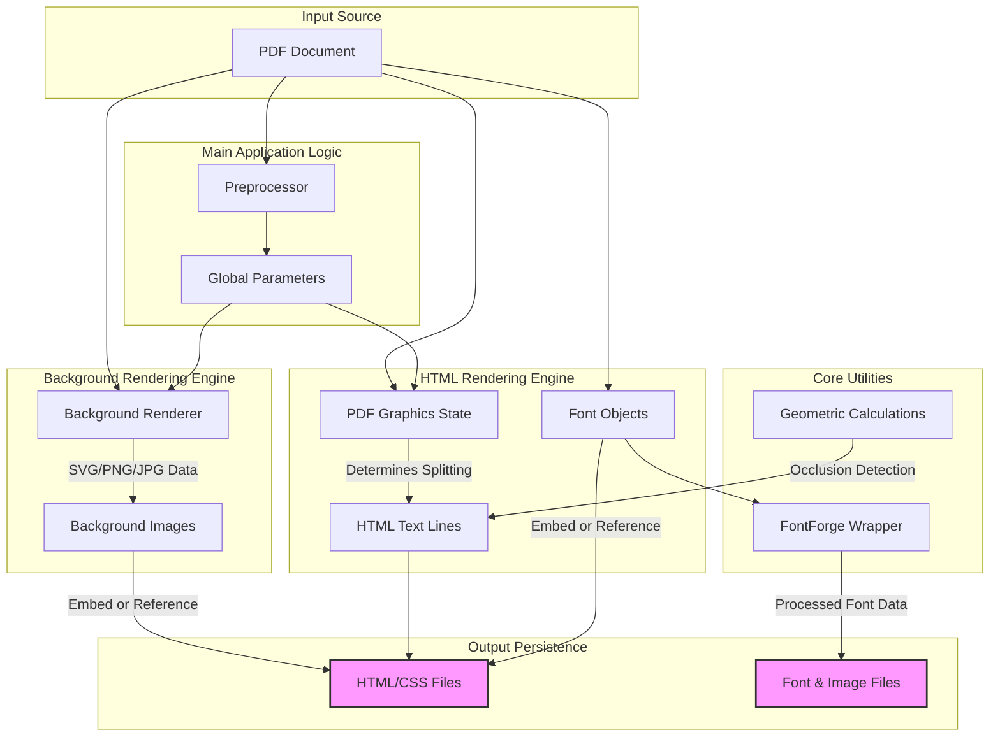

# Data Models Documentation: pdf2htmlEX

## Executive Summary
The `pdf2htmlEX` architecture is centered around the transformation of binary PDF data structures into semantic HTML/CSS representations. Unlike traditional database-driven applications, the data models in this system are primarily **in-memory C/C++ structures** that represent the parsing state of a PDF document, the graphical context of rendering operations, and the intermediate artifacts (such as font files and background images) generated during the conversion process.

The architecture does not utilize a relational database. Persistence is achieved through the generation of static web assets (HTML, CSS, embedded fonts, and images).

## Architecture Overview (Data Perspective)
The data flow is linear and pipeline-oriented, moving from raw PDF parsing to structured HTML output.

1.  **Ingestion:** The `Main Application Logic` preprocesses the PDF to identify page dimensions and font usage.
2.  **State Tracking:** The `HTML Rendering Engine` maintains the **PDF Graphics State**, tracking transformations, colors, and clipping paths as it interprets the PDF command stream.
3.  **Artifact Generation:**
    *   The `Background Rendering Engine` generates raster or vector image data (SVG, PNG, JPG).
    *   The `HTML Rendering Engine` extracts font data and converts text streams into **HTML Text Lines**.
4.  **Output:** Data is serialized into HTML/CSS files, with supporting assets (fonts, images) either embedded as Base64 or saved as external files.

## Core Data Structures

Based on the subsystem analysis, the following data structures are central to the application's operation.

### 1. PDF Processing State
**Managed by:** HTML Rendering Engine, Main Application Logic

The system relies on a dynamic state representation to interpret the PDF drawing model.

*   **PDF Graphics State:**
    *   **Description:** An in-memory structure that tracks the current context of the PDF interpreter.
    *   **Attributes (Inferred from responsibilities):** Current transformation matrices, active fonts, fill/stroke colors, and clipping paths.
    *   **Purpose:** Determines when new HTML elements (lines, spans) are required based on state changes (e.g., a change in font or color triggers a new HTML span).
*   **Preprocessor Data:**
    *   **Description:** Data collected during the initial scan of the PDF document.
    *   **Purpose:** Stores information about font usage and page dimensions to optimize the subsequent full rendering pass.

### 2. HTML Generation Structures
**Managed by:** HTML Rendering Engine, Main Application Logic

These structures bridge the gap between PDF vector commands and the DOM.

*   **HTML Text Line:**
    *   **Description:** A data structure representing a line of text in the output HTML.
    *   **Key Files:** `src/HTMLTextLine.cc`
    *   **Purpose:** Converts raw PDF line data into optimized HTML/CSS markup. It handles state management and clipping logic specific to text rendering.
*   **Interactive Elements:**
    *   **Description:** Structures representing hyperlinks and form widgets (inputs, buttons).
    *   **Purpose:** Maps PDF annotation dictionaries to HTML form elements and anchor tags.

### 3. Font & Asset Data
**Managed by:** HTML Rendering Engine, Core Utilities

*   **Font Objects:**
    *   **Description:** Extracted data from PDF font objects (TrueType, OpenType, Type1).
    *   **Key Files:** `src/HTMLRenderer/font.cc`, `src/util/ffw.c`
    *   **Persistence:** Saved as temporary external files or embedded directly into the HTML.
    *   **Processing:** Involves the FontForge wrapper (`ffw`) for font processing tasks.
*   **Background Images:**
    *   **Description:** Visual representations of the PDF page background.
    *   **Formats:** SVG (via Cairo), PNG, or JPG (via Splash).
    *   **Storage:** Managed as either external file references or Base64 data URIs embedded in the HTML stream.

### 4. Configuration & Parameters
**Managed by:** Main Application Logic

*   **Global Parameters:**
    *   **Description:** A centralized configuration object.
    *   **Key Files:** `src/Param.h`
    *   **Purpose:** Stores settings derived from command-line argument parsing that control rendering behavior (e.g., fallback limits, output paths).

### 5. Geometric & Utility Data
**Managed by:** Core Utilities

*   **Geometric Primitives:**
    *   **Description:** Data structures for matrix transformations and bounding boxes.
    *   **Purpose:** Used for calculating text visibility, occlusion (covered text detection), and coordinate mapping between PDF space and HTML screen space.

## Data Persistence & Output Formats
The application persists data by generating a set of web-compatible files.

| Output Type | Description | Generation Method |
| :--- | :--- | :--- |
| **HTML Files** | Semantic structure containing text, links, and forms. | Conversion of PDF text streams and state changes into DOM elements. |
| **CSS Files** | Styling information for layout and fonts. | Generated alongside HTML to position elements accurately. |
| **Font Files** | Binary font files (TTF, OTF, etc.). | Extracted from PDF objects and dumped to the filesystem. |
| **Image Files** | Background layers for complex PDF pages. | Rendered via Cairo (SVG) or Splash (PNG/JPG) backends. |

## Data Relationships Diagram

The following diagram illustrates the flow of data between the key architectural components and the resulting output artifacts.

## Key Data Files
*   **`src/HTMLTextLine.cc`**: Defines the logic for converting PDF line data structures into optimized HTML/CSS.
*   **`src/HTMLRenderer/state.cc`**: Contains the implementation for tracking PDF state changes.
*   **`src/HTMLRenderer/font.cc`**: Manages the extraction and persistence of font data.
*   **`src/Param.h`**: Defines the global data structure for application configuration.
*   **`src/util/ffw.c`**: C-wrapper implementation for FontForge library interactions.