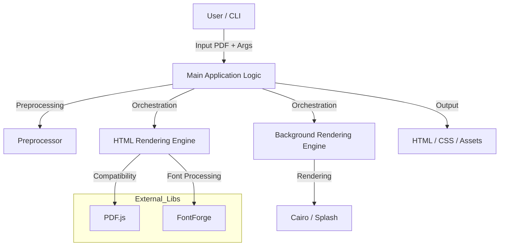

# Interfaces Documentation for pdf2htmlEX

## Executive Summary
The `pdf2htmlEX` architecture is a command-line driven application designed to convert PDF documents into HTML format. The system is primarily written in C++ and C, with dependencies on external libraries such as PDF.js and FontForge for specific rendering and font processing tasks. The architecture is organized into distinct subsystems responsible for background rendering, HTML generation, and core utilities, orchestrated by a main application logic layer.

## Architecture Overview
The system follows a modular pipeline architecture where the Main Application Logic acts as the orchestrator. It preprocesses PDF files, manages global parameters, and delegates tasks to specialized rendering engines.

The flow generally moves from:
1.  **Input:** PDF files and Command-line arguments.
2.  **Processing:** Font extraction, background rendering (Cairo/Splash), and HTML structure generation.
3.  **Output:** HTML files with embedded assets (fonts, images) and CSS.

## Technology Stack
Based on the detected codebase analysis:
-   **Primary Languages:** C++, C
-   **Secondary Languages:** HTML, Python, JavaScript
-   **Core Dependencies:** PDF.js, FontForge, Cairo, Splash

## Interfaces & Integration Points

This section details the interfaces and protocols used by `pdf2htmlEX` to communicate with the outside world and between internal components.

### 1. Command Line Interface (CLI)
The primary external interface for the application is the Command Line Interface.

-   **Type:** Synchronous Command Execution
-   **Description:** The application accepts execution parameters via standard input arguments (`argc`, `argv`).
-   **Implementation:** Handled by the `Main Application Logic` subsystem.
-   **Key Components:**
    -   **Argument Parsing:** Managed by `src/ArgParser.cc` and `src/ArgParser.h`.
    -   **Parameter Management:** Global state and configuration are stored in `src/Param.h`.
    -   **Entry Point:** The main orchestration loop resides in `src/pdf2htmlEX.cc`.
-   **Capabilities:**
    -   Parsing of rendering options (e.g., zoom, embedding formats).
    -   Global parameter management for the rendering pipeline.
    -   Preprocessing directives to scan font usage and page dimensions.

### 2. External Library Integrations
The system integrates with external native libraries to extend functionality. These are not network-based services but linked library dependencies.

#### A. FontForge Integration
-   **Purpose:** Font processing and extraction.
-   **Interface Type:** C-Wrapper / FFI (Foreign Function Interface)
-   **Description:** The application utilizes a C-wrapper to manage the lifecycle of the FontForge library and perform font processing tasks.
-   **Key Files:**
    -   `src/util/ffw.c`: Implements the wrapper logic.
    -   `src/util/ffw.h`: Header definitions for the wrapper.
-   **Responsibilities:**
    -   Lifecycle management (initialization and cleanup) of the FontForge library.
    -   Extraction and processing of font data for embedding into HTML.

#### B. PDF.js Integration
-   **Purpose:** PDF rendering and browser compatibility.
-   **Interface Type:** JavaScript Embedding / Polyfills
-   **Description:** Integrates the PDF.js library to handle underlying PDF processing and ensures cross-browser compatibility.
-   **Key Files:**
    -   `3rdparty/PDF.js/compatibility.js`
    -   `3rdparty/PDF.js/compatibility.min.js`
-   **Responsibilities:**
    -   Providing core PDF rendering and manipulation functionality.
    -   Implementing polyfills for missing DOM features (e.g., `classList`) to ensure consistent behavior across browsers.

### 3. File I/O & Data Protocol
The application operates on a file-based input/output model.

-   **Input Protocol:**
    -   **Format:** Binary PDF files.
    -   **Handling:** The `Preprocessor` scans the file for font usage and page dimensions before full rendering begins.
-   **Output Protocol:**
    -   **Format:** HTML5, CSS, JavaScript, and binary font/image assets.
    -   **Asset Management:**
        -   **Fonts:** Extracted (TrueType, OpenType, Type1) and saved as external files or embedded.
        -   **Images:** Generated via Cairo (SVG) or Splash (PNG/JPG) and embedded as Base64 data URIs or external file references.
    -   **Fallback Logic:** The `Background Rendering Engine` implements a protocol for switching rendering modes (e.g., SVG to Bitmap) if complexity exceeds configured limits.

### 4. Internal Component Communication
Internal communication between subsystems (e.g., between Main Logic and Rendering Engines) is primarily via direct function calls and shared state objects, as indicated by the lack of detected inter-folder dependencies and the high count of isolated files.

-   **State Management:** The `HTML Rendering Engine` tracks PDF graphics state (transformations, fonts, colors) internally to determine when to emit new HTML elements.
-   **Tracing:** A `DrawingTracer` (likely in `src/DrawingTracer.cc`) is used to detect text visibility and occlusion, passing this data to the HTML generator.

## Absence of Web Protocols
Based on the provided code analysis and architecture data:

-   **REST/GraphQL APIs:** **Not Detected.** The application is a CLI tool and does not expose HTTP endpoints or web service controllers.
-   **Authentication/Authorization:** **Not Detected.** No middleware or auth logic is present.
-   **WebSockets:** **Not Detected.** No real-time communication channels are implemented.
-   **External Service Calls (HTTP):** **Not Detected.** All dependencies are local libraries (PDF.js, FontForge, Cairo).

## Subsystem Interface Details

### External Dependencies Subsystem
-   **Role:** Manages the interface between the core application and third-party libraries.
-   **Key Interface:** Provides polyfills and vendor code isolation to manage updates and license compliance.

### Background Rendering Engine
-   **Role:** Handles the conversion of PDF graphics into raster or vector images.
-   **Interface:** Accepts PDF page data and returns image streams (SVG/PNG/JPG) or data URIs to the HTML generator.

### HTML Rendering Engine
-   **Role:** Converts PDF content structures into DOM elements.
-   **Interface:** Consumes font data, text streams, and image assets to output semantic HTML and CSS.

### Main Application Logic
-   **Role:** Central orchestrator.
-   **Interface:** Acts as the facade that coordinates the CLI input, preprocessing, and the various rendering engines.

### Core Utilities
-   **Role:** Shared helper functions.
-   **Interface:** Provides static/utility functions for filesystem manipulation, unicode mapping, and geometric calculations used by other subsystems.