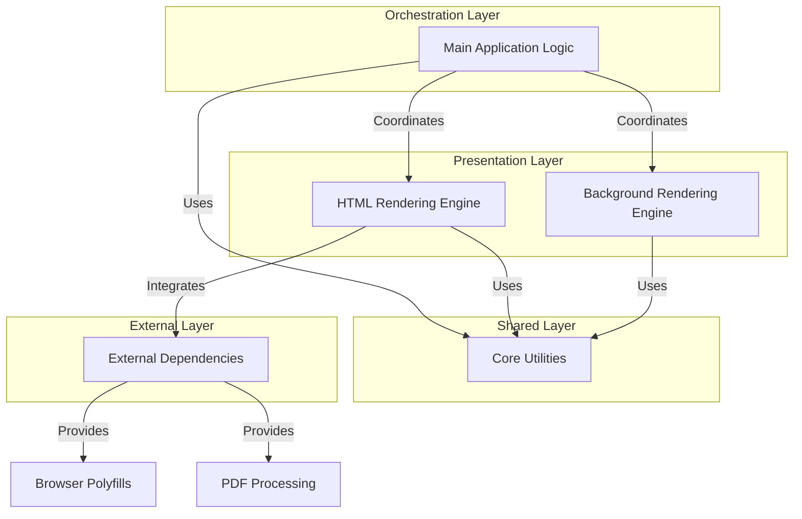

# Architecture Overview: pdf2htmlEX

## Executive Summary

The system is a specialized document conversion utility designed to transform PDF files into HTML web pages. Its primary function is to bridge the gap between static PDF documents and dynamic web content by decomposing PDF structures—such as text, images, vector paths, and fonts—and reconstructing them as semantic HTML and CSS elements. The architecture is engineered to maintain high visual fidelity, utilizing dedicated rendering engines to handle complex graphical backgrounds and ensuring that interactive components like hyperlinks and form widgets are preserved in the output.

To achieve accurate conversion, the system employs a multi-layered approach that preprocesses documents for font usage and dimensions before rendering. It leverages external libraries for low-level PDF manipulation and rendering (such as Cairo and Splash) while managing font extraction and embedding to ensure the HTML output matches the original document's typography. The result is a robust pipeline that converts fixed-layout PDFs into web-compatible formats, handling fallbacks for complex graphics and ensuring cross-browser compatibility through polyfills.

## Business Purpose and Goals

**Business purpose not explicitly documented in the codebase.** The code indicates a functional focus on technical document rendering and format conversion rather than specific business objectives.

## Key Capabilities and Features

Based on the detected subsystems and code analysis, the system provides the following capabilities:

*   **PDF to HTML Conversion:** Converts PDF content structures, including text streams, images, and vector paths, into semantic HTML DOM elements.
*   **High-Fidelity Background Rendering:** Renders page backgrounds using multiple backends (Cairo for SVG, Splash for PNG/JPG) to preserve visual quality, with automatic fallbacks to bitmap rendering if SVG complexity exceeds limits.
*   **Font Extraction and Embedding:** Extracts embedded fonts (TrueType, OpenType, Type1) from PDF objects and saves them for embedding into the HTML output.
*   **Interactive Element Support:** Renders and preserves interactive PDF features such as hyperlinks and form widgets (inputs, buttons) in the HTML version.
*   **Graphics State Management:** Interprets and tracks complex PDF graphics states, including transformations, fonts, colors, and clipping paths, to ensure accurate layout.
*   **Cross-Browser Compatibility:** Implements polyfills for missing DOM features (e.g., `classList`) to ensure the rendered HTML functions correctly across different browsers.
*   **Command-Line Interface:** Provides a robust command-line interface for argument parsing and global parameter management to control the conversion process.

## Target Audience/Users

**Not explicitly documented.**

## Business Domain Context

The system operates within the **Document Processing and Digital Archiving** domain. It addresses the need for interoperability between the PDF format and web standards, enabling documents to be viewed and interacted with in standard web browsers without requiring dedicated PDF reader plugins.

## High-Level Architecture

The architecture is organized into distinct layers responsible for orchestration, presentation, shared utilities, and external integration.

### Component Descriptions

*   **Main Application Logic:** Acts as the central orchestrator, managing the overall workflow. It handles PDF preprocessing (scanning fonts and dimensions), coordinates the rendering pipeline, and manages command-line inputs.
*   **HTML Rendering Engine:** Responsible for the core translation of PDF content into HTML. It manages the conversion of text lines, graphics states, and interactive elements.
*   **Background Rendering Engine:** Focuses on the visual aspects of the PDF pages, rendering backgrounds and complex vector graphics into images or SVGs to be embedded in the HTML.
*   **Core Utilities:** Provides a foundation of shared services, including filesystem manipulation, Unicode mapping, geometric calculations, and font processing wrappers.
*   **External Dependencies:** Manages the integration with third-party libraries (like PDF.js) required for underlying PDF processing and ensures the output works across various browser environments.

## Technology Stack Summary

The system is built primarily on compiled languages for performance-critical processing, with scripting languages used for testing and utility tasks.

*   **Primary Languages:**
    *   **C++ (30%):** Used for core rendering logic and application structure.
    *   **C (28%):** Utilized for low-level utilities and wrappers.
*   **Supporting Languages:**
    *   **HTML (7%):** Used for test fixtures and output templates.
    *   **Python (5%):** Used for testing and automation scripts.
    *   **JavaScript (2%):** Used for browser compatibility polyfills.
*   **Frameworks:** No specific frameworks were detected in the analysis.
*   **Key Libraries (Inferred from responsibilities):**
    *   **Cairo:** Used for 2D vector graphics rendering (SVG backend).
    *   **Splash:** Used for bitmap rendering (PNG/JPG backend).
    *   **FontForge:** Utilized for font processing tasks via a C-wrapper.
    *   **PDF.js:** Used for underlying PDF processing capabilities.

## Key Metrics and Scale

*   **Total Files:** 74
*   **Total Lines of Code:** 12,908
*   **Core Modules:**
    *   `src` (Core): 24 files, 3,827 LOC
    *   `src/HTMLRenderer`: 9 files, 3,419 LOC
    *   `src/util`: 19 files, 1,995 LOC