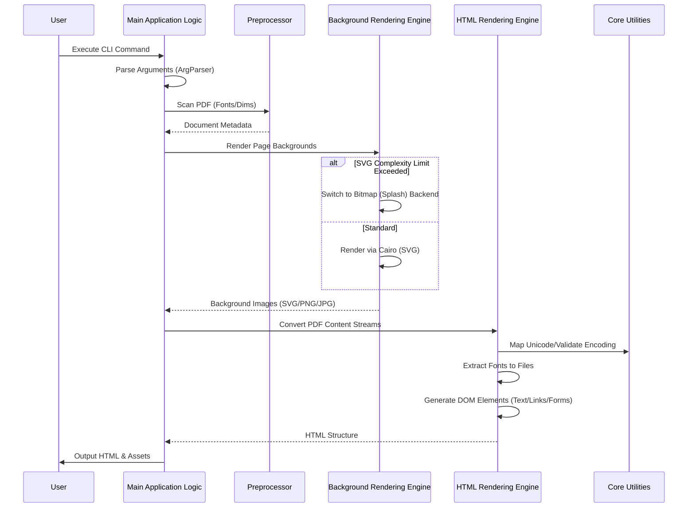

# Use Cases Documentation: pdf2htmlEX pdf2htmlEX

## Executive Summary
The `pdf2htmlEX` system is a command-line driven architecture designed to convert PDF documents into HTML representations. The primary business process facilitated by this architecture is the transformation of static PDF files—containing complex layouts, fonts, and vector graphics—into semantic HTML/CSS/JavaScript that preserves the visual fidelity of the original document. The system achieves this through a pipeline involving preprocessing, background rendering, and HTML structure generation.

## User Roles and Personas
**Status:** Not explicitly defined in code.
*   *Note:* The codebase indicates a command-line interface (`src/ArgParser.cc`, `src/pdf2htmlEX.cc`) and automated testing scripts. There is no evidence of role-based access control, authentication, or distinct user personas within the application logic. The primary "user" is an operator or developer executing the conversion binary or running the test suite.

## Key User Journeys and Workflows

### 1. PDF to HTML Conversion Workflow
This is the core workflow of the system, initiated from the command line.

*   **Trigger:** The user invokes the application via the command line, specifying input PDF files and configuration parameters.
*   **Steps:**
    1.  **Argument Parsing:** The `Main Application Logic` parses command-line arguments to configure global parameters (e.g., output format, rendering options).
    2.  **Preprocessing:** The system scans the PDF document to identify font usage and page dimensions before full rendering begins.
    3.  **Background Rendering:** The `Background Rendering Engine` processes the visual layer of the PDF pages. It attempts to render backgrounds using Cairo (SVG) or Splash (PNG/JPG) backends.
    4.  **HTML Structure Generation:** The `HTML Rendering Engine` converts PDF content streams (text, images, vector paths) into semantic HTML DOM elements.
    5.  **Font Extraction:** Embedded fonts (TrueType, OpenType, Type1) are extracted from the PDF and dumped to external files for embedding in the HTML.
    6.  **Output Generation:** The system combines the background images, HTML structure, and font resources into the final output files.

### 2. Output Validation and Testing Workflow
This workflow is intended for developers verifying the correctness of the conversion engine.

*   **Trigger:** A developer executes the test suite (e.g., `test/test_output.py`, `test/test_remote_browser.py`).
*   **Steps:**
    1.  **Test Execution:** The test runner invokes the conversion logic on specific PDF fixtures (e.g., `geneve_1564`, `svg_background_with_page_rotation_issue402`).
    2.  **Browser Validation:** `test_remote_browser.py` loads the generated HTML in a remote browser environment to verify rendering behavior.
    3.  **Comparison:** The system compares the generated output against expected results to detect regressions in text positioning, background rendering, or font embedding.

## Feature Descriptions (User Perspective)

### Visual Fidelity via Background Rendering
*   **Description:** The system ensures that the converted HTML looks visually identical to the source PDF.
*   **Implementation:** It supports rendering page backgrounds as high-quality vector graphics (SVG) or bitmaps (PNG/JPG).
*   **Fallback Logic:** If the vector graphics (SVG) exceed a configured complexity limit, the system automatically falls back to bitmap rendering to maintain performance and stability.

### Font Preservation
*   **Description:** The system preserves the typography of the original document by extracting and embedding fonts.
*   **Implementation:** It supports TrueType, OpenType, and Type1 fonts. Fonts are extracted from the PDF and saved as external files referenced by the generated HTML.

### Interactive Element Support
*   **Description:** The system converts interactive PDF features into web-standard HTML elements.
*   **Implementation:** Hyperlinks and form widgets (inputs, buttons) detected in the PDF are rendered as corresponding HTML anchor tags and form elements.

### Cross-Browser Compatibility
*   **Description:** The generated output is designed to function across different web browsers.
*   **Implementation:** The system includes polyfills (via `External Dependencies`) for missing DOM features, such as `classList`, ensuring consistent behavior in older browser environments.

## Sequence Diagrams

### PDF Conversion Sequence
This diagram illustrates the flow of the primary conversion process based on the subsystem responsibilities.

## Edge Cases and Error Handling

*   **SVG Complexity Overflow:** The `Background Rendering Engine` handles cases where SVG rendering might be too complex or heavy. It implements a fallback mechanism to switch to bitmap rendering (Splash backend) when limits are exceeded.
*   **Missing DOM Features:** To handle environments with incomplete DOM implementations, the `External Dependencies` subsystem includes compatibility scripts (e.g., `compatibility.js`) that polyfill missing features like `classList`.
*   **Text Occlusion:** The `Main Application Logic` includes graphical tracing capabilities to detect text visibility and occlusion, ensuring that covered text is handled correctly during the HTML generation phase.

## Common Usage Patterns

*   **Batch Processing:** While not explicitly defined as a "batch" feature in the metadata, the presence of `test/test_output.py` and the file manipulation utilities in `Core Utilities` suggests the tool is frequently used to process multiple documents or specific test fixtures in succession.
*   **Base64 Embedding:** The `Background Rendering Engine` supports embedding generated images directly into the HTML stream using Base64 data URIs, a pattern useful for creating self-contained HTML files without external image dependencies.