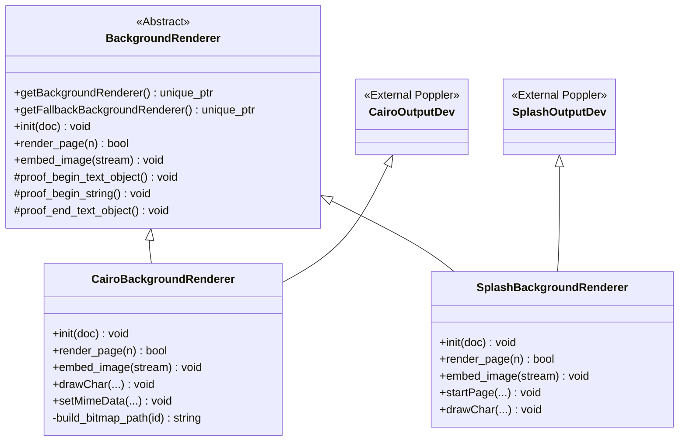

# Code Structure Documentation: `src/BackgroundRenderer`

## Module Overview
The `src/BackgroundRenderer` module provides a pluggable architecture for rendering PDF page backgrounds. It decouples the rendering logic from the main application by using an Abstract Factory pattern to instantiate specific rendering strategies based on configuration parameters. The module supports two primary rendering backends: a vector-based backend using Cairo (SVG output) and a raster-based backend using Poppler's Splash library (PNG/JPG output).

## Directory and File Organization
The module consists of 6 files located in `src/BackgroundRenderer/`. The structure follows a standard C++ header/implementation pairing, with a central base class defining the interface and factory logic.

### File List
*   `BackgroundRenderer.h` (53 LOC) - Abstract base class definition and factory declarations.
*   `BackgroundRenderer.cc` (131 LOC) - Factory implementation and shared proof rendering logic.
*   `CairoBackgroundRenderer.h` (76 LOC) - Header for the Cairo-based vector renderer.
*   `CairoBackgroundRenderer.cc` (311 LOC) - Implementation of the SVG rendering engine.
*   `SplashBackgroundRenderer.h` (65 LOC) - Header for the Splash-based raster renderer.
*   `SplashBackgroundRenderer.cc` (177 LOC) - Implementation of the PNG/JPG rendering engine.

## Architectural Patterns

### 1. Strategy & Interface Pattern
The module utilizes an abstract base class `BackgroundRenderer` to define a common contract for rendering operations. Concrete implementations (`CairoBackgroundRenderer` and `SplashBackgroundRenderer`) inherit from this base class, allowing the system to swap rendering algorithms at runtime without changing the calling code.

*   **Interface:** `BackgroundRenderer` defines pure virtual methods:
    *   `init(PDFDoc *)`
    *   `render_page(int)`
    *   `embed_image(std::ostream &)`
*   **Implementations:**
    *   `CairoBackgroundRenderer`: Inherits from `BackgroundRenderer` and `CairoOutputDev`.
    *   `SplashBackgroundRenderer`: Inherits from `BackgroundRenderer` and `SplashOutputDev`.

### 2. Abstract Factory
The `BackgroundRenderer` class acts as a factory for creating renderer instances. The factory logic is implemented in `BackgroundRenderer.cc`.

*   **`getBackgroundRenderer`**: Instantiates renderers based on the requested format string:
    *   `"png"` or `"jpg"` $\rightarrow$ Returns `SplashBackgroundRenderer`.
    *   `"svg"` $\rightarrow$ Returns `CairoBackgroundRenderer`.
*   **`getFallbackBackgroundRenderer`**: Provides a fallback mechanism. If the primary format is SVG and a node limit is configured, it returns a `SplashBackgroundRenderer`.

### 3. Template Method
Both concrete renderers override specific hook methods defined in their respective Poppler base classes (`CairoOutputDev` or `SplashOutputDev`) to customize behavior. Common hooks include:
*   `drawChar`: Controls character visibility based on proof modes or coverage checks.
*   `beginTextObject`, `beginString`, `endTextObject`: Hooks for proof visualization logic.
*   `updateRender`: Hooks for render updates.

## Component Organization

### Core Component: `BackgroundRenderer`
*   **Files:** `BackgroundRenderer.h`, `BackgroundRenderer.cc`
*   **Responsibility:** Defines the rendering interface, manages object creation via factory methods, and implements shared "proof" rendering utilities (text visualization logic using RGB colors).
*   **Key Functions:**
    *   `getBackgroundRenderer` (Factory)
    *   `getFallbackBackgroundRenderer` (Factory)
    *   `proof_begin_text_object`, `proof_begin_string`, `proof_end_text_object` (Shared Logic)

### Vector Rendering Component: `CairoBackgroundRenderer`
*   **Files:** `CairoBackgroundRenderer.h`, `CairoBackgroundRenderer.cc`
*   **Responsibility:** Handles vector graphics rendering to SVG format. Manages complex logic such as extracting embedded bitmaps to external files, handling text rasterization fallbacks, and monitoring SVG node counts.
*   **Key Functions:**
    *   `render_page`: Renders to SVG surface, checks node count limits.
    *   `setMimeData`: Intercepts image data for external bitmap extraction.
    *   `embed_image`: Generates HTML tags (`` or `<embed>`) for the SVG.

### Raster Rendering Component: `SplashBackgroundRenderer`
*   **Files:** `SplashBackgroundRenderer.h`, `SplashBackgroundRenderer.cc`
*   **Responsibility:** Handles raster graphics rendering to PNG or JPEG formats. Manages bitmap creation, text visibility filtering, and image embedding (Base64 or external file).
*   **Key Functions:**
    *   `render_page`: Renders page to bitmap.
    *   `startPage`: Overrides default behavior to prevent full-page background paint.
    *   `embed_image`: Writes bitmap to disk or embeds as Base64.

## Dependency Graph

### Internal Dependencies
The module relies on specific internal structures for configuration and coordination:
*   **`Param`**: A configuration structure (referenced in all renderers) containing parameters like `svg_node_count_limit`, `embed_image`, and proof mode flags.
*   **`HTMLRenderer`**: The main rendering coordinator. Both background renderers hold a reference to `HTMLRenderer` to coordinate text layer coverage and output generation.
*   **`Base64Stream`**: Used by `embed_image` functions in both renderers to encode image data.

### External Dependencies
The module heavily depends on the **Poppler** PDF library and specific graphics backends:

*   **Cairo Library**:
    *   Used by: `CairoBackgroundRenderer`
    *   Headers: `cairo.h`, `cairo-svg.h`
    *   Base Class: `CairoOutputDev`

*   **Poppler (Splash Backend)**:
    *   Used by: `SplashBackgroundRenderer`
    *   Headers: `SplashOutputDev.h`, `splash/SplashBitmap.h`
    *   Base Class: `SplashOutputDev`

*   **Standard C++ Library**:
    *   `fstream`, `string`, `vector`, `unordered_map` (Standard I/O and containers).

## Class Hierarchy

## Code Patterns and Logic Flow

### 1. Instantiation Flow
1.  Calling code invokes `BackgroundRenderer::getBackgroundRenderer(format, param, html_renderer)`.
2.  Factory checks `format` string (e.g., "svg", "png").
3.  Factory returns `std::unique_ptr<CairoBackgroundRenderer>` or `std::unique_ptr<SplashBackgroundRenderer>`.
4.  Caller initializes the renderer using the `init(PDFDoc*)` method.

### 2. Rendering Flow
1.  `render_page(page_index)` is called on the concrete instance.
2.  **Cairo:** Creates SVG surface, renders content, checks node count. If limit exceeded, returns `false` (signaling fallback).
3.  **Splash:** Creates bitmap, renders content.
4.  `embed_image(output_stream)` is called to generate the final HTML representation.

### 3. Resource Management
*   **CairoBackgroundRenderer:** Tracks reference counts for extracted bitmaps using `std::unordered_map`. The destructor cleans up temporary bitmap files with zero reference counts.
*   **SplashBackgroundRenderer:** Manages bitmap memory via the Splash library and handles file I/O for external images.

## Build Configuration
*   **Conditional Compilation:** The module uses preprocessor checks (e.g., `HAVE_SPLASH`, `HAVE_CAIRO`) to enable or disable specific rendering backends.
*   **Format Support:** `SplashBackgroundRenderer` validates format support at construction based on compilation flags (support for PNG/JPG).