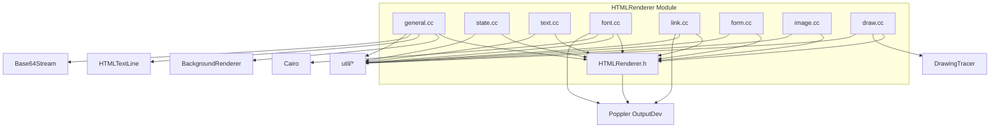

# Code Structure Documentation: `src/HTMLRenderer`

## Overview
The `src/HTMLRenderer` module implements the core conversion logic for transforming PDF documents into HTML/CSS representations. The module is architecturally centered around the `HTMLRenderer` class, which inherits from Poppler's `OutputDev` class to intercept PDF rendering commands.

The codebase is organized into a flat structure of 9 files (1 header, 8 implementation files), separating concerns such as state management, text rendering, font extraction, and form processing. The implementation relies heavily on the State pattern to track PDF graphics state changes and the Strategy pattern to handle different content types (e.g., Type 3 fonts vs. TrueType fonts).

## Directory Structure
The module resides in `src/HTMLRenderer/` and contains the following files:

*   **`HTMLRenderer.h`**: Main header defining the `HTMLRenderer` class interface, state variables, and method declarations.
*   **`general.cc`**: Orchestrates the high-level workflow, including document processing, page iteration, and file output management.
*   **`state.cc`**: Manages the tracking and synchronization of PDF graphics state (fonts, transformations, clipping) into internal HTML rendering states.
*   **`text.cc`**: Implements logic for parsing PDF text strings, calculating character metrics, and handling ligatures/spacing.
*   **`font.cc`**: Handles font extraction from PDF objects, including dumping embedded fonts (TTF, OTF, CFF) and rendering Type 3 fonts to SVG.
*   **`link.cc`**: Processes PDF link annotations and converts them into HTML anchor tags with CSS positioning.
*   **`form.cc`**: Converts PDF form field widgets into HTML input elements and buttons.
*   **`image.cc`**: Manages image rendering, delegating to the base `OutputDev` class while invoking tracers.
*   **`draw.cc`**: Implements drawing primitives (stroke, fill, clip) by delegating commands to an internal `tracer` object.

## Module Organization & Key Components

### Core Class: `HTMLRenderer`
Defined in `HTMLRenderer.h`, this class serves as the central coordinator for the subsystem.

*   **Type**: `struct` / `class`
*   **Inheritance**: Extends `OutputDev` (from Poppler).
*   **Responsibility**: Intercepts PDF drawing commands, manages internal state, and orchestrates the generation of HTML output.

### Functional Decomposition
The implementation is split across `.cc` files based on specific responsibilities:

| File | Responsibility | Key Functions |
| :--- | :--- | :--- |
| **`general.cc`** | Lifecycle & Orchestration | `process()`, `startPage()`, `endPage()`, `pre_process()` |
| **`state.cc`** | State Tracking | `updateAll()`, `updateFont()`, `check_state_change()`, `reset_state()` |
| **`text.cc`** | Text Processing | `drawString()`, `is_char_covered()` |
| **`font.cc`** | Font Handling | `dump_embedded_font()`, `dump_type3_font()` |
| **`link.cc`** | Link Annotation | `processLink()`, `get_linkaction_str()` |
| **`form.cc`** | Form Handling | `process_form()` |
| **`image.cc`** | Image Handling | `drawImage()`, `drawSoftMaskedImage()` |
| **`draw.cc`** | Drawing Primitives | `stroke()`, `fill()`, `eoFill()`, `saveState()` |

## Dependencies

### External Dependencies
The module relies on the following external libraries:
*   **Poppler**: Core PDF processing library. Used types include `OutputDev`, `GfxState`, `PDFDoc`, `GfxFont`, `Annot`, `Page`, `Form`, `Link`, `GlobalParams`, `FoFiTrueType`, `CharCodeToUnicode`.
*   **Cairo**: Used specifically in `font.cc` for rendering Type 3 fonts to SVG (`cairo`, `cairo-ft`, `cairo-svg`).
*   **Standard C++ Library**: `iostream`, `sstream`, `algorithm`, `vector`, `functional`, `cmath`, `fstream`, `memory`, `unordered_map`, `unordered_set`.

### Internal Dependencies
The module imports several internal utilities and headers:
*   **Utilities**: `util/namespace`, `util/unicode`, `util/math`, `util/path`, `util/misc`, `util/const`, `util/css_const`, `util/encoding`, `util/ffw`.
*   **Core Components**: `Param.h`, `Preprocessor.h`, `pdf2htmlEX-config.h`.
*   **Sub-modules**:
    *   `BackgroundRenderer/BackgroundRenderer.h`
    *   `CoveredTextDetector.h`
    *   `DrawingTracer.h`
    *   `HTMLTextLine.h`
    *   `Base64Stream.h`

## Entry Points
*   **`HTMLRenderer::process`** (`general.cc`): The main entry point for processing a PDF document. It handles the iteration through pages, DPI scaling, and background rendering management.
*   **`HTMLRenderer::HTMLRenderer`** (`general.cc`): Constructor that initializes the renderer, sets up Poppler global settings, and configures state managers.

## Code Patterns & Architectural Decisions

### 1. Inheritance & Template Method
*   **Pattern**: The `HTMLRenderer` inherits from `OutputDev`.
*   **Implementation**: Virtual methods like `startPage`, `endPage`, `drawString`, and `drawImage` are overridden to implement custom logic while relying on the base class for standard PDF stream handling.

### 2. State Management
*   **Pattern**: Observer / State Pattern.
*   **Implementation**: `state.cc` implements a series of `update*` methods (`updateFont`, `updateCTM`, `updateTextPos`) that track changes in the PDF graphics state. The `check_state_change` function analyzes these changes to determine if new HTML elements (lines/spans) are required.

### 3. Strategy Pattern
*   **Pattern**: Conditional logic based on content type.
*   **Implementation**:
    *   **Fonts**: `font.cc` uses a factory-like approach to determine how to dump a font (raw extraction vs. SVG rendering for Type 3) based on the font subtype.
    *   **Links**: `link.cc` switches on `LinkAction` kind to determine the correct href target.
    *   **Text**: `text.cc` alters rendering logic based on font type (e.g., skipping rendering for Type 3 fonts).

### 4. Delegation Pattern
*   **Pattern**: Delegating specific tasks to helper objects.
*   **Implementation**:
    *   **Drawing**: `draw.cc` and `image.cc` delegate drawing commands to a `tracer` object (`DrawingTracer`).
    *   **Background**: `general.cc` utilizes `BackgroundRenderer` for non-text processing.

## Layering
The module exhibits a clear separation of concerns:
1.  **Interface Layer**: `HTMLRenderer.h` defines the public contract and state structure.
2.  **Orchestration Layer**: `general.cc` manages the control flow and document lifecycle.
3.  **Logic Layer**: `state.cc`, `text.cc`, `font.cc`, `link.cc`, and `form.cc` contain the specific algorithms for converting PDF semantics to HTML/CSS.
4.  **Primitive Layer**: `draw.cc` and `image.cc` handle low-level drawing operations, often delegating further to the `tracer` or parent `OutputDev`.

## Dependency Graph
The following diagram illustrates the relationships between the files in this module and their key dependencies.

## Build Configuration
*   **Languages**: C++, C
*   **Total Lines of Code**: 3419
*   **Build Tools**: Not explicitly determined from the provided file analysis data (no `Makefile`, `CMakeLists.txt`, or `package.json` was analyzed).