# Code Structure Documentation: `src/util`

## Module Overview
The `src/util` module serves as the **Core Utilities** subsystem for the application. It provides foundational services for file system abstraction, mathematical calculations, text encoding, font processing, and platform compatibility. The module is implemented in a mix of C and C++, acting as a bridge between high-level application logic and low-level libraries such as FontForge and Poppler.

## Directory Structure
The module follows a flat directory structure located at `src/util/`. It contains 19 files, organized primarily as header-implementation pairs.

### File Inventory
*   **`const.h` / `const.cc`** - Global constants and configuration mappings.
*   **`encoding.h` / `encoding.cc`** - Text encoding (UTF-8) and escaping logic.
*   **`ffw.h` / `ffw.c`** - C wrapper interface for the FontForge library.
*   **`math.h` / `math.cc`** - Geometric transformations and bounding box calculations.
*   **`mingw.h` / `mingw.cc`** - Windows/MinGW compatibility layer.
*   **`misc.h` / `misc.cc`** - Miscellaneous helpers (CSS geometry, color formatting).
*   **`namespace.h`** - Convenience header for standard library using declarations.
*   **`path.h` / `path.cc`** - File path manipulation and directory creation.
*   **`SignalHandler.h` / `SignalHandler.cc`** - Crash handling and signal management.
*   **`unicode.h` / `unicode.cc`** - Unicode validation and mapping logic.

## Component Organization

The module is organized by functional responsibility rather than strict layers, though distinct logical groupings are evident.

### 1. Font Processing Subsystem
This group handles the complex logic required to manipulate and sanitize fonts, bridging the application with the FontForge library.

*   **`ffw.h` / `ffw.c`**
    *   **Role:** Implements a **Facade Pattern** and **Wrapper Pattern** around the FontForge C library.
    *   **Key Struct:** `FFWVersionInfo` (holds version date information).
    *   **Key Functions:** `ffw_init`, `ffw_load_font`, `ffw_prepare_font`, `ffw_reencode_raw`, `ffw_save`.
    *   **Logic:** Manages font lifecycle (load, sanitize, re-encode, save). It enforces business rules such as removing kerning pairs and alternate unicodes during preparation.

*   **`unicode.h` / `unicode.cc`**
    *   **Role:** Validates and maps Unicode characters derived from PDF fonts to HTML-safe representations.
    *   **Patterns:** **Strategy** and **Fallback Strategy**.
    *   **Key Functions:** `is_illegal_unicode`, `map_to_private`, `check_unicode`.
    *   **Logic:** Identifies illegal HTML characters (e.g., control characters) and maps problematic characters to Private Use Areas (PUA), specifically avoiding the mobile Safari emoji range (0xE000-0xE5FF).

### 2. System & Platform Abstraction
This group abstracts operating system differences, primarily focusing on Windows compatibility and file system operations.

*   **`mingw.h` / `mingw.cc`**
    *   **Role:** Provides **Polyfill** functionality for Windows/MinGW environments.
    *   **Key Functions:** `mkdtemp` (POSIX compatibility), `get_exec_dir`, `get_tmp_dir`.
    *   **Logic:** Implements POSIX functions missing on Windows (like `mkdtemp`) and handles path resolution for executable and temporary directories using environment variables.

*   **`path.h` / `path.cc`**
    *   **Role:** File system and path manipulation utilities.
    *   **Key Functions:** `create_directories` (recursive), `sanitize_filename`, `is_truetype_suffix`, `get_filename`.
    *   **Logic:** Handles directory creation with error checking (e.g., `errno` checks) and sanitizes filenames to prevent format string injection attacks.

*   **`SignalHandler.h` / `SignalHandler.cc`**
    *   **Role:** Manages application lifecycle and crash reporting.
    *   **Patterns:** **Global State** and **Signal Handling Pattern**.
    *   **Key Functions:** `setupSignalHandler`, `ffwSetAction`, `signalHandler`.
    *   **Logic:** Intercepts fatal signals (SIGSEGV, SIGFPE) to write diagnostic information to stderr. It uses low-level I/O for safety during crashes.

### 3. Rendering & Geometry
This group provides mathematical primitives and CSS-specific adjustments required for rendering PDF content in HTML.

*   **`math.h` / `math.cc`**
    *   **Role:** Low-level geometric calculations.
    *   **Patterns:** **Static Utility**.
    *   **Key Functions:** `tm_transform`, `tm_multiply`, `tm_transform_bbox`, `bbox_intersect`.
    *   **Logic:** Performs 2D affine transformation matrix operations and bounding box intersections using an epsilon (`EPS`) threshold for floating-point comparisons.

*   **`misc.h` / `misc.cc`**
    *   **Role:** CSS-specific geometry fixes and data formatting.
    *   **Patterns:** **Operator Overloading**.
    *   **Key Functions:** `css_fix_rectangle_border_width`, `operator<<` (for `GfxRGB`), `hash_ref`.
    *   **Logic:** Adjusts rectangle dimensions to account for differences between PDF (border centered) and HTML (border outside) rendering models.

### 4. Data & Text Management
This group handles configuration constants and text serialization.

*   **`const.h` / `const.cc`**
    *   **Role:** Centralized configuration and lookup tables.
    *   **Key Data:**
        *   `ID_MATRIX`: Identity matrix definition.
        *   `GB_ENCODED_FONT_NAME_MAP`: Maps GB encoded byte strings to standard font names.
        *   `EMBED_STRING_MAP`: Defines embedding strategies (base64 vs external) for CSS, JS, PNG.
        *   `FORMAT_MIME_TYPE_MAP`: Maps file extensions to MIME types.
    *   **Key Struct:** `EmbedStringEntry`.

*   **`encoding.h` / `encoding.cc`**
    *   **Role:** Text encoding and output escaping.
    *   **Patterns:** **Function Overloading**, **Stream Processing**.
    *   **Key Functions:** `writeUnicodes`, `writeJSON`, `writeAttribute`, `mapUTF8`.
    *   **Logic:** Converts Unicode to UTF-8 and escapes special characters for HTML entities, JSON strings, and HTML attributes (including specific IE backtick handling).

*   **`namespace.h`**
    *   **Role:** Code style convenience.
    *   **Logic:** Contains `using` declarations for `std::string`, `std::iostream`, etc., to reduce verbosity in other source files.

## Dependency Graph

The module exhibits a dependency structure where internal utilities depend on one another, and specific components depend heavily on external libraries like FontForge and Poppler.

```mermaid
graph TD
    subgraph "External Libraries"
        FontForge[FontForge Library]
        Poppler[Poppler Library]
        Cairo[Cairo]
    end

    subgraph "src/util"
        FFW_C[ffw.c]
        FFW_H[ffw.h]
        Signal_CC[SignalHandler.cc]
        Signal_H[SignalHandler.h]
        Unicode_CC[unicode.cc]
        Unicode_H[unicode.h]
        Path_CC[path.cc]
        Path_H[path.h]
        MingW_CC[mingw.cc]
        MingW_H[mingw.h]
        Misc_CC[misc.cc]
        Misc_H[misc.h]
        Const_CC[const.cc]
        Const_H[const.h]
        Encoding_CC[encoding.cc]
        Encoding_H[encoding.h]
        Math_CC[math.cc]
        Math_H[math.h]
        Namespace_H[namespace.h]
    end

    %% Internal Dependencies
    Path_CC --> MingW_H
    Signal_CC --> FFW_H
    Misc_CC --> Const_H
    Encoding_CC --> Const_H
    Math_CC --> Math_H
    Unicode_CC --> Unicode_H
    FFW_C --> FFW_H
    Signal_CC --> Signal_H

    %% External Dependencies
    FFW_C --> FontForge
    Signal_CC --> Poppler
    Signal_CC --> Cairo
    Unicode_CC --> Poppler
    Misc_CC --> Poppler
```

### External Dependencies
*   **FontForge:** Heavily utilized by `ffw.c`. Dependencies include `fontforge.h`, `baseviews.h`, `fontforge/encoding.h`, `fontforge/savefont.h`, and others.
*   **Poppler:** Utilized by `SignalHandler.cc` (GlobalParams), `unicode.cc` (GlobalParams), and `misc.cc` (GfxState, GfxRGB).
*   **Cairo:** Referenced as a dependency in `SignalHandler.cc`.

### Internal Dependencies
*   `path.cc` depends on `mingw.h` for Windows compatibility functions.
*   `SignalHandler.cc` depends on `util/ffw.h` to manage FontForge context during crashes.
*   `misc.cc` depends on `util/const.h`.
*   `encoding.cc` depends on `const.h`.

## Architectural Patterns

*   **Wrapper / Facade Pattern:** The `ffw` module completely wraps the C-based FontForge library, providing a clean C-linkage interface (`extern "C"`) to the rest of the application.
*   **Polyfill Pattern:** The `mingw` module abstracts platform-specific filesystem behaviors, ensuring the rest of the codebase can use POSIX-like functions (`mkdtemp`) on Windows.
*   **Static Utility / Functional Pattern:** Modules like `math` and `encoding` utilize stateless functions or static inline functions for transformations and escaping.
*   **Strategy Pattern:** `unicode.cc` employs a fallback strategy for character mapping, attempting to resolve from font names first, then falling back to private use area mapping.

## Key Data Structures

| Name | Type | Location | Purpose |
| :--- | :--- | :--- | :--- |
| `FFWVersionInfo` | `struct` | `ffw.h`, `ffw.c` | Holds version date information for the FontForge wrapper. |
| `EmbedStringEntry` | `struct` | `const.h` | Defines configuration for embedding resources (e.g., base64 vs external link). |
| `ID_MATRIX` | `array[6]` | `const.cc` | The identity matrix `[1.0, 0.0, 0.0, 1.0, 0.0, 0.0]`. |
| `GB_ENCODED_FONT_NAME_MAP` | `map` | `const.cc` | Maps GB encoded byte strings to standard font names (e.g., SimSun). |
| `EMBED_STRING_MAP` | `map` | `const.cc` | Maps file extensions (.css, .js, .png) to embedding strategies. |
| `FORMAT_MIME_TYPE_MAP` | `map` | `const.cc` | Maps file extensions (eot, jpg, otf, etc.) to MIME type strings. |
| `sigaction act` | `struct` | `SignalHandler.cc` | POSIX structure defining signal handler behavior (global). |

## Build Configuration & Tooling
*   **Build Configuration:** Not determined from available code (no Makefile or CMakeLists.txt provided in analysis).
*   **Entry Points:** The module does not contain a standard `main` entry point. However, it exposes subsystem initialization entry points:
    *   `ffw_init` (in `ffw.c`): Initializes the FontForge environment.
    *   `setupSignalHandler` (in `SignalHandler.cc`): Initializes the crash reporting subsystem.