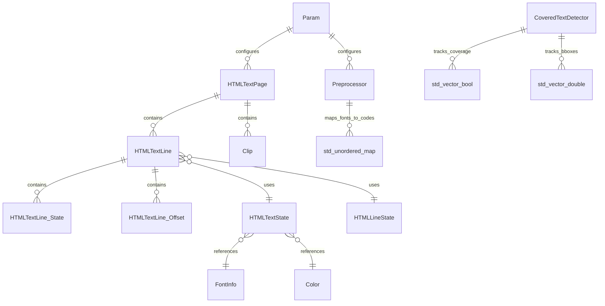

# Data Models Documentation

## Module Overview

The `src` module serves as the core utility subsystem for a PDF to HTML conversion application. It defines a comprehensive set of data structures and models to manage the transformation of PDF document states into optimized HTML/CSS representations. The data models focus heavily on representing text layout, font metrics, graphical states (colors, transforms), and configuration parameters.

**Note:** This module does not utilize a traditional database schema. Persistence is handled via file system operations (generating HTML/CSS output) and temporary file management.

## Core Configuration Data

### `Param`
*   **Type:** `struct`
*   **Source:** `src/Param.h`
*   **Description:** Acts as the central Data Transfer Object (DTO) for the application, aggregating all configuration settings required for the conversion process.
*   **Attributes (Categories):**
    *   Page ranges (first_page, last_page).
    *   Rendering dimensions (DPI, zoom).
    *   Output options (embedding CSS, fonts, images).
    *   Font processing settings (format, hinting).
    *   Text layout adjustments.
    *   Background rendering settings.
    *   Encryption credentials.
*   **Usage:** Passed to subsystems to inject configuration and control behavior.

## Rendering State Models

### `FontInfo`
*   **Type:** `struct`
*   **Source:** `src/HTMLState.h`
*   **Description:** Stores metadata about fonts used during rendering.
*   **Attributes:**
    *   Font ID.
    *   Unicode mapping.
    *   Metrics (ascent, descent).
    *   Type 3 scaling factors (`font_size_scale`).
*   **Constraint:** Type 3 fonts require a specific scaling factor to normalize glyph sizes.

### `HTMLTextState`
*   **Type:** `struct`
*   **Source:** `src/HTMLState.h`
*   **Description:** Represents the current styling and layout state for text rendering.
*   **Attributes:**
    *   Current font.
    *   Current color.
    *   Spacing settings (word space, letter space).
*   **Computed Properties:**
    *   `single_space_offset`: Calculated as the sum of word space, letter space, and scaled font space width.
    *   `em_size`: Derived from font size multiplied by the difference between font ascent and descent.

### `HTMLLineState`
*   **Type:** `struct`
*   **Source:** `src/HTMLState.h`
*   **Description:** Represents the geometric and logical state of a line of text.
*   **Attributes:**
    *   Transform matrices.
    *   Visibility check flags.

### `HTMLClipState`
*   **Type:** `struct`
*   **Source:** `src/HTMLState.h`
*   **Description:** Defines the bounding box for a clipping region.

### `Color`
*   **Type:** `struct` (Value Object)
*   **Source:** `src/Color.h`, `src/Color.cc`
*   **Description:** Encapsulates RGB color values and transparency status, bridging internal logic with external PDF graphics types (`GfxRGB`).
*   **Attributes:**
    *   `transparent` (`bool`): Indicates if the color is transparent.
    *   `r`, `g`, `b`: Components stored within a `GfxRGB` structure.
*   **Methods:**
    *   `distance`: Calculates normalized Euclidean distance between colors.
    *   `get_gfx_color`: Converts internal state to external `GfxColor`.

## Text & Page Representation

### `HTMLTextPage`
*   **Type:** `class`
*   **Source:** `src/HTMLTextPage.h`
*   **Description:** Container for a page's worth of text lines, managing optimization and HTML generation.
*   **Data Structures:**
    *   `text_lines`: Collection of `HTMLTextLine` objects.
    *   `clips`: Collection of `Clip` structures.
*   **Attributes:**
    *   `width`: Page width.
    *   `height`: Page height.

### `HTMLTextLine`
*   **Type:** `class`
*   **Source:** `src/HTMLTextLine.h`
*   **Description:** Manages the representation, optimization, and serialization of a single line of text.
*   **Internal Data Structures:**
    *   `State` (struct): Contains IDs for CSS properties, hash values, and optimization flags.
    *   `Offset` (struct): Stores the start index and width of a horizontal offset (whitespace).
*   **Data Vectors:**
    *   `text`: Stores Unicode characters.
    *   `decomposed_text`: Stores glyphs corresponding to multiple Unicode code points.
    *   `offsets`: Stores `Offset` objects.
    *   `states`: Stores `State` objects.
*   **Data Rules:**
    *   Multi-code-point glyphs are stored in `decomposed_text` and referenced by negative indices in the main `text` vector.
    *   Padding characters (value 0) are ignored during output but maintained in the vector to preserve character indexing consistency.

### `Clip`
*   **Type:** `struct`
*   **Source:** `src/HTMLTextPage.h`
*   **Description:** Internal structure representing a clipping region.
*   **Attributes:**
    *   Clipping region boundaries.
    *   Starting index of text lines affected by the clip.

## Geometry & Visibility Models

### `CoveredTextDetector`
*   **Type:** `class`
*   **Source:** `src/CoveredTextDetector.h`
*   **Description:** Analyzes drawing operations to identify text obscured by graphics.
*   **Data Structures:**
    *   `std::vector<bool>`: Stores coverage status (true if covered) for each character.
    *   `std::vector<double>`: Stores coordinates (x0, y0, x1, y1) for character bounding boxes.
    *   `std::vector<int>`: Stores the count of visible points for each character.
*   **Logic:**
    *   A character is marked covered if all four corners are determined to be invisible (not in clip, fill, or stroke).

### `Preprocessor`
*   **Type:** `class`
*   **Source:** `src/Preprocessor.h`
*   **Description:** Scans PDF documents to collect metadata.
*   **Data Structures:**
    *   `std::unordered_map<long long, char*>`: Maps font IDs to character code bitmaps (code maps).
*   **Attributes:**
    *   `max_width`: Maximum page width encountered.
    *   `max_height`: Maximum page height encountered.

## Utility Data Structures

### `StateManager` (Template)
*   **Type:** `class` (Template)
*   **Source:** `src/StateManager.h`
*   **Description:** Generic mechanism to install values, assign unique IDs, and generate CSS rules (Flyweight pattern).
*   **Specializations:**
    *   `FontSizeManager`, `ColorManager`, `TransformMatrixManager`, etc.
*   **Data Storage:**
    *   Uses `std::map` and `std::unordered_map` to map values to IDs.
*   **Comparators/Hashers:**
    *   `Matrix_less`: Compares `Matrix` objects using only the first 4 elements.
    *   `Color_hash`: Hashes `Color` objects; transparent colors are assigned a specific hash value of all bits set (`~0`).
*   **Validation Rules:**
    *   Double values are considered equal if their absolute difference is less than or equal to `eps`.

### `TmpFiles`
*   **Type:** `class`
*   **Source:** `src/TmpFiles.h`
*   **Description:** Registry for temporary files.
*   **Data Structures:**
    *   `std::set<std::string>`: Stores filenames of tracked temporary files.

### `ArgParser`
*   **Type:** `class`
*   **Source:** `src/ArgParser.h`
*   **Description:** Manages command-line argument definitions.
*   **Data Structures:**
    *   `ArgEntryBase` / `ArgEntry` (struct): Stores metadata for arguments (name, description, requirements).
    *   `ArgParserCallBack` (type): Function pointer for argument callbacks.

## Entity Relationships

The following diagram illustrates the relationships between the primary data structures defined in the module.

## Data Validation & Constraints

### Text Rendering Rules
*   **Decomposed Text:** In `HTMLTextLine`, if a glyph corresponds to multiple Unicode code points, it is stored in `decomposed_text` and referenced by a negative index in the main `text` vector.
*   **Padding Characters:** Characters with a value of 0 are treated as padding; they are ignored during HTML output but retained in the vector to maintain consistent character indexing.
*   **Small Offsets:** Offsets smaller than a specific epsilon (`h_eps`) are ignored during rendering.

### State Management Rules
*   **Double Comparison:** In `StateManager`, double values are compared using an epsilon value (`eps`) to determine equality.
*   **Matrix Comparison:** Matrices are compared strictly using their first 4 elements.
*   **Color Hashing:** Transparent colors are assigned a specific hash value of `~0` (all bits set).

### Visibility Detection Rules
*   **Occlusion:** A character is considered covered if its bounding box intersects with a non-character graphic drawn after it.
*   **Corner Visibility:** A character is marked covered if all four corners of its bounding box are determined to be invisible (outside clip, fill, or stroke).

## Persistence & Serialization

While no database is used, the module handles data persistence through the following mechanisms:

*   **HTML/CSS Generation:** `HTMLTextPage` and `HTMLTextLine` serialize their internal state vectors to `std::ostream` (HTML output).
*   **Base64 Encoding:** `Base64Stream` wraps binary input streams to serialize data into Base64 text format for embedding in HTML.
*   **Temporary File Management:** `TmpFiles` tracks file paths in a `std::set` and manages their lifecycle (creation and deletion) based on the `clean_tmp` parameter in `Param`.