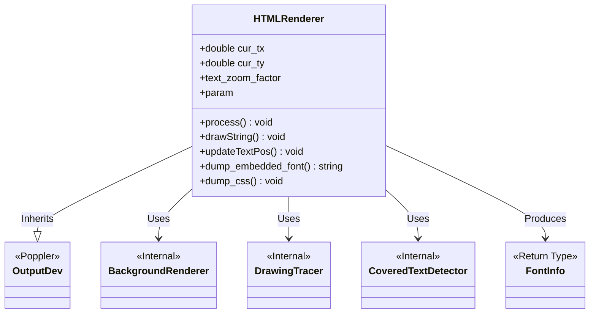

# Data Models Documentation

## Module Overview
The `src/HTMLRenderer` module serves as the core data transformation engine for converting PDF document structures into HTML/CSS representations. From a data modeling perspective, the module functions as a stateful processor that interprets Poppler's internal PDF object graph (`GfxState`, `GfxFont`, etc.), maintains an internal rendering state, and serializes this data into file-based persistence layers (HTML, CSS, and extracted font files).

There are no traditional database schemas or ORM entities defined in this module. Instead, data persistence is handled via file system generation and internal C++ object state management.

## Data Structures & Entities

### HTMLRenderer (Class/Struct)
The central entity managing the conversion lifecycle and internal state.

**Base Class:**
*   `OutputDev` (Poppler library)

**Explicitly Defined Attributes:**
*   `cur_tx` (double): Current text X-coordinate. Updated via `updateTextPos`.
*   `cur_ty` (double): Current text Y-coordinate. Updated via `updateTextPos`.
*   `text_zoom_factor`: A composite scaling factor split into `factor1` (internal metric accuracy) and `factor2` (CSS transformation).
*   `param`: Configuration object containing rendering parameters (e.g., `tmp_file_size_limit`, `split_pages`, `process_nontext`).

**Relationships:**
*   **Uses:** `BackgroundRenderer`, `CoveredTextDetector`, `DrawingTracer`.
*   **Produces:** `FontInfo` objects via `install_font`.

### FontInfo (Referenced Type)
A data structure returned by the font installation logic.

*   **Context:** Referenced as a return type for `HTMLRenderer::install_font`.
*   **Details:** No explicit fields were provided in the analysis data.

### External Data Structures (Poppler Types)
The module consumes and processes data from the following external structures provided by the Poppler library:
*   `GfxState`: Tracks graphics state (transformations, colors, clipping).
*   `GfxFont`, `GfxCIDFont`, `Gfx8BitFont`: Represent font data and metrics.
*   `GooString`: Handles string data.
*   `LinkAction`, `LinkDest`: Represent hyperlink data and destinations.
*   `Object`, `Stream`: Handle generic PDF object and stream data.

## Persistence & Serialization

The module persists data by generating files on the file system. The "schemas" for these outputs are defined implicitly by the generation logic.

### 1. Font Files
The module extracts font data from PDF objects and persists them as temporary files.

**File Extensions & Mapping:**
*   `.cff`: Mapped from FontDescriptor Subtype 'Type1C'.
*   `.otf`: Mapped from FontDescriptor Subtype 'OpenType'.
*   `.ttf`: Standard TrueType font output.
*   `.svg`: Generated for Type 3 fonts.

**Constraints:**
*   Type 3 fonts are scaled such that the longer edge of their bounding box is `100.0` units (`GLYPH_DUMP_EM_SIZE`).

### 2. HTML & CSS Output
The module generates structured text files representing the document.

**Output Streams:**
*   HTML Document(s): Contains the structural markup.
*   CSS File(s): Contains styling information generated via `dump_css`.

**Persistence Rules:**
*   **Split Pages:** If `param.split_pages` is enabled, each page is written to a separate file, and a frame is written to the main pages file.
*   **Size Limits:** Processing stops if the total size of temporary files exceeds `param.tmp_file_size_limit`.

## Data Relationships (Class Diagram)

## Data Validation & Constraints

### Coordinate & Transformation Logic
*   **Matrix Proportionality:** Text is only merged into the current line if transformation matrices are proportional (indicating parallel text).
*   **Zero Handling:** Character width and height default to `0.001` if calculated as zero to prevent rendering errors.
*   **Negative Font Sizes:** Inverted to positive values, with the transformation matrix adjusted accordingly.

### Resource Management
*   **DPI Clamping:** DPI is clamped to a maximum calculated as `72 * 9000 / max(page_width, page_height)` to prevent excessive memory usage.
*   **Font Skipping:** Text rendering is skipped if the font render mode is `>= 4`.

### Link Processing
*   **Page Validation:** Link destinations with a page number `<= 0` result in an empty detail string (validation failure).

## Data Migration Patterns
*   **Not Applicable:** No database migration patterns are present in this module. Data flow is unidirectional from PDF (Poppler) objects to File System output.