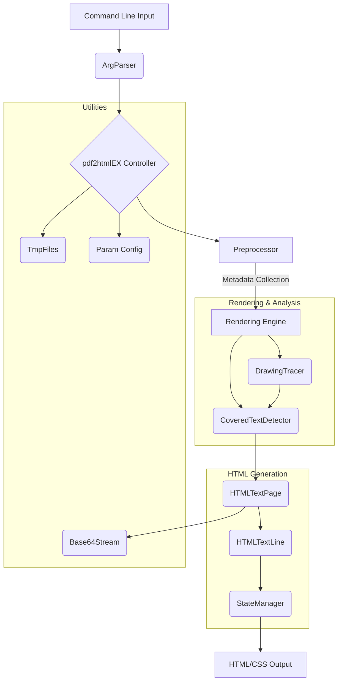

# Module Overview: src

## Executive Summary

This module serves as the core engine for a document conversion system, specifically designed to transform PDF documents into HTML and CSS representations. The system addresses the complexity of maintaining visual fidelity during this conversion by performing a multi-stage analysis of the source PDF. It handles the intricate details of text positioning, font usage, and graphical elements to ensure the resulting web page accurately reflects the original document's layout.

The value provided by this module lies in its ability to intelligently optimize the output. Beyond simple conversion, it analyzes the document structure to detect text visibility (handling cases where text is obscured by images), manages CSS states to minimize redundancy, and preprocesses fonts to ensure only necessary characters are embedded. This results in HTML output that is both visually accurate and efficient in terms of file size and structure.

## Business Purpose and Goals

The primary business purpose of this module is to provide a robust command-line tool for converting PDF files into HTML format.

Based on the code analysis, the system is designed to:
*   Convert PDF documents into HTML/CSS.
*   Maintain the visual layout of the original document, including precise text positioning and styling.
*   Optimize the generated HTML to reduce file size and improve rendering efficiency.

## Key Capabilities and Features

The module implements the following key capabilities to achieve its conversion goals:

*   **PDF to HTML Conversion:** The core functionality provided by `pdf2htmlEX`, which orchestrates the entire conversion workflow, including parsing command-line arguments and managing the output process.
*   **Text Rendering and Optimization:** The `HTMLTextLine` and `HTMLTextPage` components manage the conversion of PDF text structures into HTML. They handle text content, offsets, style states, and whitespace intelligently, optimizing the output by merging styles.
*   **Text Visibility Detection:** The `CoveredTextDetector` analyzes the drawing order of elements to identify text characters that are visually covered or obscured by non-text graphical elements (like strokes or fills), ensuring correct visual representation.
*   **Geometric Analysis:** The `DrawingTracer` intercepts drawing operations from the PDF rendering pipeline to calculate bounding boxes and analyze geometry, which aids in occlusion detection and layout accuracy.
*   **Font Usage Analysis:** The `Preprocessor` performs a preliminary scan of the PDF document to collect metadata, specifically tracking which character codes are used for each font to optimize font subsetting.
*   **CSS State Management:** The `StateManager` system centralizes the management of CSS styles, ensuring that duplicate style values are not repeated in the output, thereby reducing the final HTML file size.
*   **Resource Management:** The `TmpFiles` utility tracks and cleans up temporary files generated during the conversion process, ensuring system resources are managed efficiently.
*   **Asset Embedding:** The `Base64Stream` utility allows for the embedding of binary data (such as images or fonts) directly into the HTML output using Base64 encoding.

## Target Audience/Users

*   **Not explicitly documented** in the codebase. The presence of a command-line argument parser (`ArgParser`) suggests the tool is intended for use via a terminal or command-line interface, but specific user personas (e.g., developers, end-users) are not defined in the provided data.

## Business Domain Context

This module operates within the **Document Conversion** and **Digital Publishing** domain. It deals with the transformation of static, print-oriented formats (PDF) into web-friendly, interactive formats (HTML/CSS). The domain context involves handling complex vector graphics, typography, and layout algorithms to bridge the gap between fixed-layout page descriptions and responsive web technologies.

## High-Level Architecture

The system follows a pipeline architecture where the PDF document flows through several stages of analysis and transformation.

**Key Components:**
*   **Controller:** `pdf2htmlEX` (Main entry point).
*   **Configuration:** `ArgParser`, `Param`.
*   **Analysis:** `Preprocessor`, `DrawingTracer`, `CoveredTextDetector`.
*   **Generation:** `HTMLTextPage`, `HTMLTextLine`, `StateManager`.
*   **Utilities:** `TmpFiles`, `Base64Stream`, `Color`.

## Technology Stack Summary

The module is built using the following technologies:

*   **Languages:** C, C++
*   **Core Libraries:**
    *   **Poppler:** Used for PDF rendering and document structure analysis (evidenced by dependencies like `PDFDoc`, `GfxState`, `OutputDev`).
    *   **Cairo:** Used for graphics operations and surface recording (evidenced by `cairo.h` usage).
    *   **Fontforge:** Referenced for font processing capabilities.
*   **System Libraries:** Standard C libraries for file system operations (`unistd.h`, `sys/stat.h`) and argument parsing (`getopt.h`).
*   **Output Formats:** HTML, CSS.

## Key Metrics and Scale

Based on the module metadata provided:
*   **Total Files:** 24
*   **Total Lines of Code:** 3,827
*   **Importance Score:** 80.0 (High importance within the system)
*   **Complexity:** The module contains components with high complexity assessments (e.g., `HTMLTextLine`, `StateManager`, `DrawingTracer`), indicating significant logic handling for layout and state management.