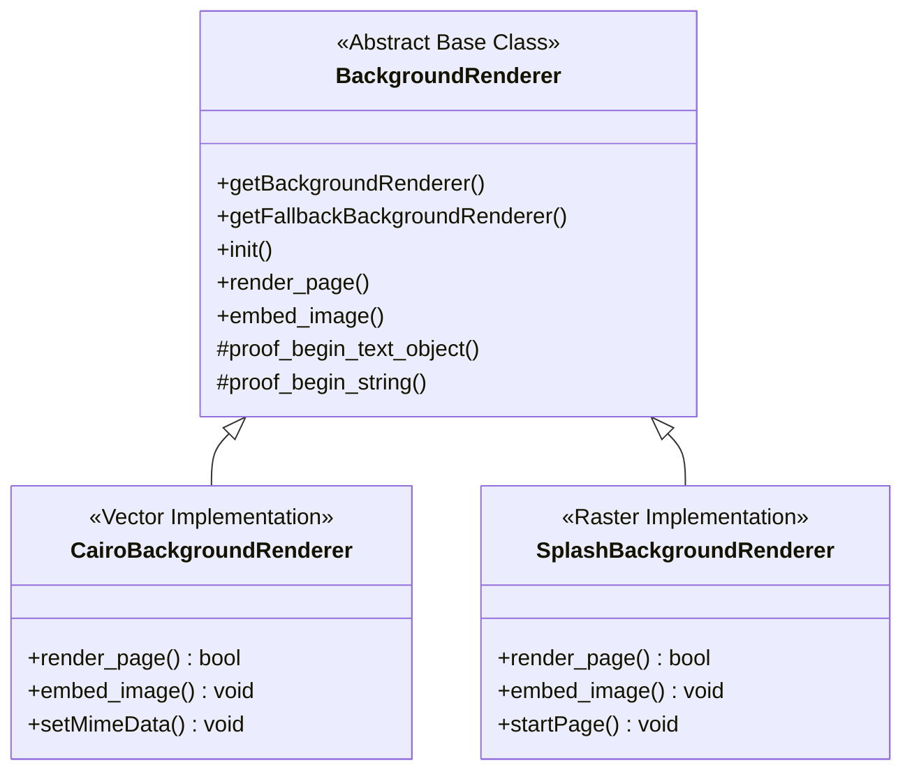

# Background Renderer Module Overview

## Executive Summary

The Background Rendering Engine module is responsible for converting PDF page backgrounds into web-compatible formats for HTML output. It addresses the challenge of rendering complex PDF graphical elements that may not be fully supported by a standard HTML text layer alone. By providing two distinct rendering strategies—vector-based (SVG) and raster-based (PNG/JPG)—the module ensures that visual fidelity is preserved across different types of document content.

The module provides significant value through its performance safeguards and resource management capabilities. It includes logic to automatically switch from high-quality vector rendering to raster rendering if the complexity of a page exceeds a configured threshold, preventing system slowdowns or excessive file sizes. Additionally, it handles the extraction and management of embedded images within PDFs, ensuring that resources are optimized for web delivery.

## Business Purpose and Goals

The primary functional purpose of this module is to render PDF page backgrounds into SVG files or raster images (PNG/JPG) and manage their integration into HTML output. The specific goals evidenced in the code include:

*   **Format Flexibility:** Providing output options for both vector (SVG) and raster (PNG, JPG) formats to meet different fidelity and performance requirements.
*   **Robustness:** Ensuring that complex fonts or graphical modes trigger appropriate fallback rendering behaviors to maintain output integrity.
*   **Resource Optimization:** Extracting embedded bitmaps to external files rather than embedding them directly in SVGs to manage file size and structure.

## Key Capabilities and Features

Based on the implemented code, the module provides the following key capabilities:

*   **Vector Rendering (SVG):** Uses the Cairo library to generate scalable vector graphics for PDF backgrounds, including support for text rendering and complex paths.
*   **Raster Rendering (PNG/JPG):** Uses the Poppler Splash backend to generate high-quality raster images, supporting both PNG and JPEG formats based on compilation flags.
*   **Automatic Fallback Mechanism:** Monitors the complexity of SVG generation (via node counts) and automatically triggers a switch to the Splash (bitmap) renderer if the `svg_node_count_limit` is exceeded.
*   **Embedded Bitmap Extraction:** Identifies and extracts specific JPEG streams embedded in PDFs to external files, avoiding direct embedding in SVGs when specific conditions (DCT streams, specific color spaces) are met.
*   **Proof Visualization:** Offers a "proof" mode that alters text colors (Red, Green, Blue, Yellow) to visualize text fill and stroke modes, aiding in the debugging of text rendering logic.
*   **Flexible Output Embedding:** Supports embedding rendered backgrounds into HTML as either Base64 data URIs or as references to external files.

## Target Audience/Users

*Not explicitly documented in the codebase.*

## Business Domain Context

The module operates within the domain of **Document Conversion and Digital Publishing**. It serves as a critical subsystem in a larger pipeline (indicated by dependencies on an `HTMLRenderer`) that transforms static PDF documents into interactive or web-based HTML formats. The module specifically handles the "background" layer of the document, distinct from the text layer, to ensure that complex vector art, images, and page furniture are accurately reproduced in the target web format.

## High-Level Architecture

The module is structured around an Abstract Factory pattern, decoupling the main application logic from specific graphics libraries.

**Component Descriptions:**
*   **BackgroundRenderer:** The abstract interface defining the contract for all rendering operations and factory methods for instantiation.
*   **CairoBackgroundRenderer:** Concrete implementation utilizing the Cairo library for vector (SVG) output. Handles complex logic for node counting and bitmap extraction.
*   **SplashBackgroundRenderer:** Concrete implementation utilizing the Poppler Splash library for raster (PNG/JPG) output. Serves as the primary fallback or performance-optimized renderer.

## Technology Stack Summary

The module is implemented using the following technologies:

*   **Languages:** C, C++
*   **Graphics Libraries:**
    *   **Cairo Library:** Used for vector graphics rendering and SVG surface generation.
    *   **Poppler (Splash Backend):** Used for raster bitmap rendering and image format support.
*   **PDF Processing:** Poppler Core (CairoOutputDev, SplashOutputDev).

## Key Metrics and Scale

*   **Code Volume:** 813 lines of code across 6 files.
*   **Complexity:**
    *   **CairoBackgroundRenderer:** High complexity (Score: 3), attributed to the logic required for handling font fallbacks, bitmap extraction, and node counting.
    *   **SplashBackgroundRenderer:** Medium complexity (Score: 2).
*   **Module Importance:** 58.1 (based on structural analysis).