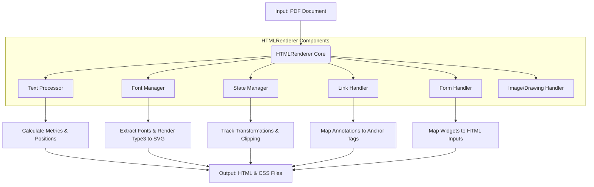

# Module Overview: HTML Rendering Engine

## Executive Summary

The `src/HTMLRenderer` module serves as the core engine for converting Portable Document Format (PDF) documents into web-standard HTML and CSS representations. It addresses the technical challenge of translating complex PDF drawing commands, text streams, and embedded resources into a format compatible with web browsers. The module's primary value lies in its ability to maintain visual fidelity by accurately calculating text positioning, extracting and embedding fonts, and converting vector graphics and forms into HTML elements.

This system functions by intercepting PDF rendering commands via an interface with the Poppler library. It processes these commands through a pipeline that handles text extraction, font management, state tracking, and form conversion. The result is a structured HTML output that preserves the layout and styling of the original source document, enabling the display of PDF content in environments where native PDF rendering is not available or desired.

## Business Purpose and Goals

The business purpose is not explicitly documented in the codebase. However, based on the implemented functionality, the module's technical objectives are:

*   To provide a high-fidelity conversion pipeline from PDF documents to HTML/CSS.
*   To preserve the visual layout of the original document, including text flow, font styling, and form elements.
*   To manage system resources effectively by implementing constraints on memory usage (DPI clamping) and temporary file storage.

## Key Capabilities and Features

Based on the implemented code, the module provides the following capabilities:

*   **Text Rendering and Layout:** Converts PDF text streams into HTML text elements. This includes calculating precise character positions, handling font metrics (ascent, width, glyph origins), managing character and word spacing, and decomposing ligatures into individual Unicode characters.
*   **Font Extraction and Embedding:** Extracts embedded font data (TTF, OTF, CFF) from PDF documents and saves them for use in HTML. It specifically handles Type 3 fonts by rendering glyphs to SVG files to ensure they are displayed correctly.
*   **State Management:** Tracks PDF graphics state changes—such as transformations, fonts, colors, and clipping regions—to determine when new HTML elements (lines or spans) are required, optimizing the output structure.
*   **Interactive Elements:**
    *   **Links:** Translates PDF link annotations (internal page jumps and external URIs) into HTML anchor tags with CSS positioning and styling.
    *   **Forms:** Converts PDF form widgets (text fields and buttons) into positioned HTML input and button elements.
*   **Resource Management:** Implements constraints to prevent excessive resource consumption, such as dynamically clamping the DPI based on page dimensions and halting processing if temporary file sizes exceed configured limits.
*   **Drawing Primitives:** Handles the rendering of paths, shapes, strokes, fills, and transparency groups, ensuring that vector graphics are accounted for in the conversion process.

## Target Audience/Users

Not explicitly documented in the code.

## Business Domain Context

This module operates within the domain of **document processing and digital publishing**. It functions as a translation layer between the proprietary, binary format of PDFs and the open standards of the web (HTML/CSS). The domain context involves handling typesetting concepts (glyphs, ligatures, bounding boxes) and mapping them to web layout models (CSS transforms, absolute positioning).

## High-Level Architecture

The module is architected around a central `HTMLRenderer` class that orchestrates the conversion process. It relies on a set of specialized handlers to manage specific aspects of the PDF format.

## Technology Stack Summary

The module is implemented using the following technologies:

*   **Languages:** C++, C
*   **Core Libraries:**
    *   **Poppler:** Used for parsing PDF structures, accessing document pages, and retrieving font and text information.
    *   **Cairo:** Utilized for rendering Type 3 fonts to SVG and handling graphics operations.
*   **Standard Libraries:** Standard C++ Library (iostream, fstream, algorithm, cmath, etc.).

## Key Metrics and Scale Information

The module includes specific logic to handle scale and resource constraints:

*   **DPI Clamping:** The rendering resolution (DPI) is dynamically clamped to a maximum value calculated as `72 * 9000 / max(page_width, page_height)` to prevent excessive memory usage during processing.
*   **File Size Limits:** The conversion process includes a check to stop processing if the total size of generated temporary files exceeds a configured limit (`param.tmp_file_size_limit`).
*   **Code Scale:** The subsystem consists of approximately 3,419 lines of code across 9 files, indicating a substantial, focused implementation effort.