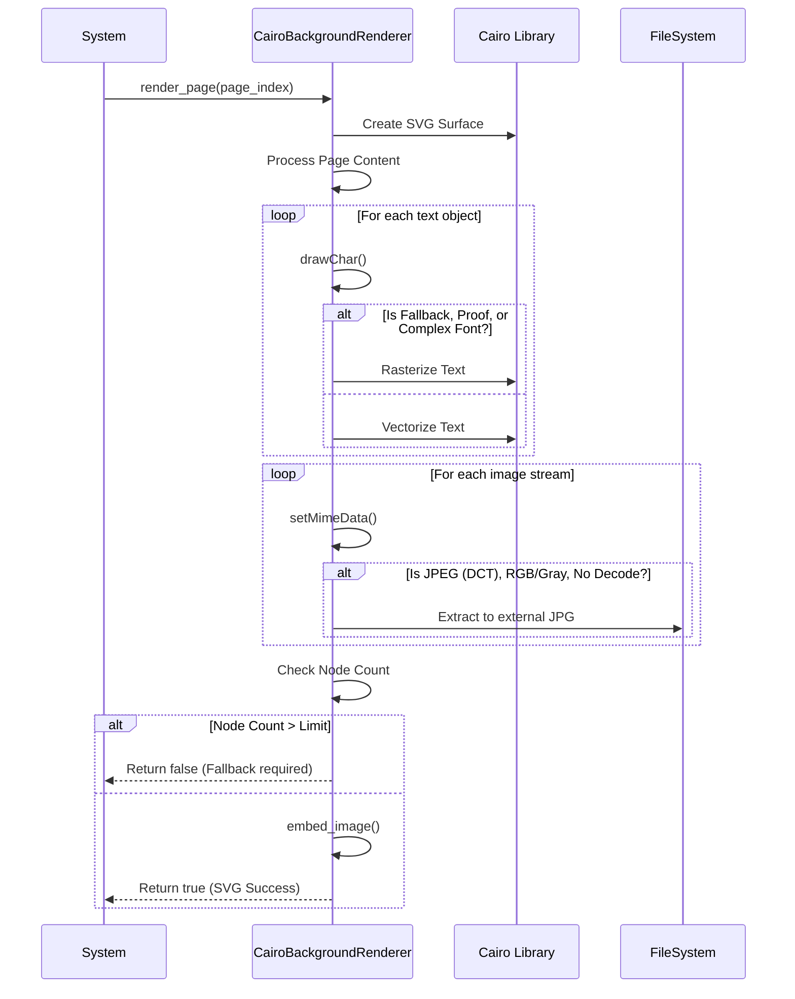
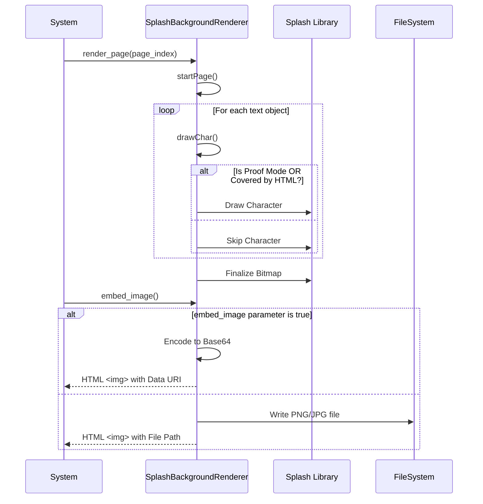

# Use Cases Documentation: BackgroundRenderer Module

## Overview
The `src/BackgroundRenderer` module provides the core logic for converting PDF page backgrounds into web-compatible image formats. It supports two primary rendering strategies: **Vector (SVG)** via the Cairo library and **Raster (PNG/JPG)** via the Splash library. The module manages the selection of the appropriate renderer based on configuration, handles fallback scenarios when vector rendering becomes too complex, and provides utilities for visualizing text rendering logic (proofing).

**Note:** User roles and personas are **not explicitly defined in code**. The module functions as a backend rendering engine invoked by a parent system.

---

## Key Use Cases

### 1. Select Rendering Strategy
**Description:** The system determines the appropriate rendering engine to instantiate based on the requested output format and system configuration.

**Business Rules:**
*   The factory method `getBackgroundRenderer` instantiates a renderer based on the format string:
    *   **'svg'**: Instantiates `CairoBackgroundRenderer`.
    *   **'png' or 'jpg'**: Instantiates `SplashBackgroundRenderer`.
*   If the requested format is not supported or the feature is disabled at compile time, the factory returns `nullptr`.
*   A specific fallback factory `getFallbackBackgroundRenderer` exists to provide a `SplashBackgroundRenderer` (bitmap) if the primary format is 'svg' and a node limit (`svg_node_count_limit`) is configured (>= 0).

**Workflow:**
1.  System calls `BackgroundRenderer::getBackgroundRenderer` with the desired format string.
2.  System validates the returned pointer is not null.
3.  System initializes the renderer with the PDF document via `init`.

---

### 2. Render Vector Background (SVG)
**Description:** Converts a PDF page background into a scalable vector graphic (SVG) using the Cairo library. This use case includes handling complex text, extracting embedded images, and managing SVG complexity.

**Business Rules:**
*   **Complexity Fallback:** If the SVG node count exceeds the configured `svg_node_count_limit`, the renderer signals that a fallback to a bitmap renderer is required (returns `false` from `render_page`).
*   **Text Handling:** Text is rasterized (drawn as an image within the SVG) if any of the following conditions are met:
    *   The system is in fallback mode.
    *   The system is in proof mode.
    *   The font is a writing mode font.
    *   The font is a Type 3 font (and not processed).
    *   The text is used as a path.
*   **Image Extraction:** Embedded bitmaps in the PDF are extracted to external files (JPG) only if they meet strict criteria:
    *   The stream is DCT (JPEG).
    *   The color space is DeviceRGB or DeviceGray.
    *   There is no Decode array.
*   **HTML Embedding Strategy:**
    *   Uses the `` tag if the SVG contains no external bitmaps OR if the `svg_embed_bitmap` parameter is true.
    *   Uses the `<embed>` tag otherwise.

**Workflow:**
1.  `CairoBackgroundRenderer::render_page` is called for a specific page.
2.  The renderer creates an SVG surface and processes page content.
3.  The renderer checks the SVG node count against the limit.
4.  The `drawChar` method determines if text should be vectorized or rasterized based on font modes.
5.  The `setMimeData` method intercepts image streams to extract valid JPEGs to disk.
6.  The `embed_image` method generates the appropriate HTML tag (`` or `<embed>`) and handles base64 encoding if necessary.

---

### 3. Render Raster Background (PNG/JPG)
**Description:** Converts a PDF page background into a raster bitmap image (PNG or JPG) using the Splash library. This use case focuses on generating a snapshot of the page background, often used when vector fidelity is not required or as a fallback.

**Business Rules:**
*   **Format Support:** Only PNG and JPG image formats are supported, determined by compilation flags.
*   **Text Visibility:** Characters are drawn only if:
    *   The system is in proof mode.
    *   The character is covered by the HTML renderer's text layer.
*   **Image Embedding:**
    *   If the `embed_image` parameter is true, the image is embedded as a Base64 data URI.
    *   Otherwise, the image is saved as an external file.

**Workflow:**
1.  `SplashBackgroundRenderer::render_page` is called for a specific page.
2.  The renderer initializes the bitmap surface.
3.  The `startPage` method prevents the default full-page background paint.
4.  The `drawChar` method filters text based on coverage and proof mode.
5.  The `embed_image` method writes the bitmap to disk or memory and generates the HTML `` tag.

---

### 4. Visualize Text Rendering (Proof Mode)
**Description:** Provides a visualization of text rendering logic to assist in debugging or verifying text boundaries and rendering modes. This alters the appearance of text to distinguish between fill and stroke operations.

**Business Rules:**
*   **Color Logic:**
    *   **Fill Color:** Set to Red or Green depending on the distance from Red.
    *   **Stroke Color:** Set to Blue or Yellow depending on the distance from Blue.
*   **Hidden Text:** Text with render mode 3 (hidden) is skipped and not rendered during proof visualization.

**Workflow:**
1.  System enters proof mode.
2.  `proof_begin_text_object` initializes the graphics state with an RGB color space.
3.  `proof_begin_string` modifies the current fill and stroke colors based on the rules above.
4.  Text is rendered with the modified colors.
5.  `proof_end_text_object` restores the original render mode.

---

## Sequence Diagrams

### Vector Rendering Workflow (Cairo)
This flow demonstrates the process of rendering a page to SVG, including the decision points for text rasterization and image extraction.

### Raster Rendering Workflow (Splash)
This flow demonstrates the process of rendering a page to a bitmap (PNG/JPG) and embedding it.

---

## Error Handling and Edge Cases

*   **Factory Failure:** If `getBackgroundRenderer` cannot match the requested format or if the feature is disabled at compile time, it returns `nullptr`. The calling system must handle this null pointer.
*   **Cairo Errors:** `CairoBackgroundRenderer` throws `std::string` exceptions for Cairo library errors or file I/O failures during rendering or extraction.
*   **Unsupported Formats:** `SplashBackgroundRenderer` throws `std::string` exceptions if the requested image format is not supported (only PNG/JPG are valid).
*   **Resource Cleanup:** The `CairoBackgroundRenderer` destructor tracks bitmap reference counts and cleans up temporary bitmap files that have a zero reference count.

## Common Usage Patterns

*   **Hybrid Rendering:** The system is designed to attempt vector rendering first (`CairoBackgroundRenderer`). If the complexity limit is exceeded (indicated by `render_page` returning `false`), the system utilizes the `getFallbackBackgroundRenderer` to switch to raster rendering (`SplashBackgroundRenderer`) for that specific page.
*   **Resource Management:** External bitmap files generated during vector rendering are managed via reference counting. They are persisted only if referenced by the final output and cleaned up automatically when the renderer is destroyed if they are no longer needed.