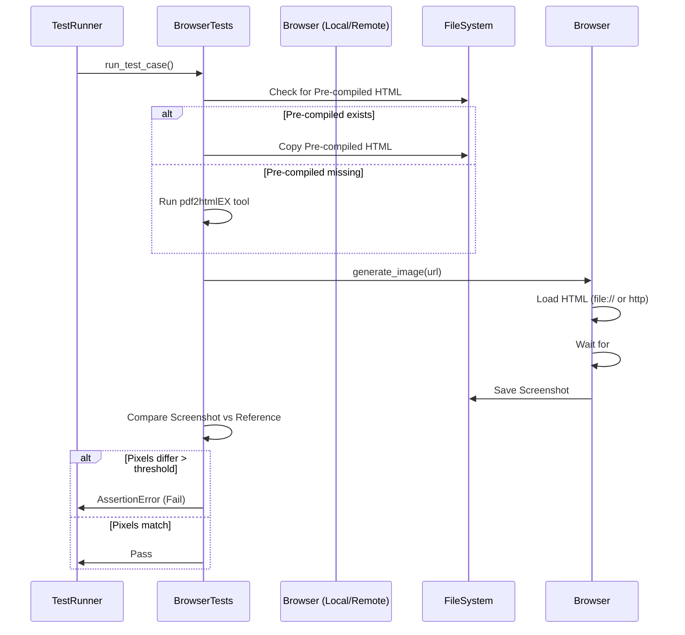

# Use Cases Documentation: test

## Overview
The `test` module provides a comprehensive suite of workflows designed to validate the PDF-to-HTML conversion engine. It supports visual regression testing (both locally and via remote cloud services), automated verification of output file generation, and batch processing of PDF documents. The module ensures that rendering fidelity, file naming conventions, and specific edge cases (such as invalid Unicode or rotated pages) meet system requirements.

## User Roles and Personas
*   **Not explicitly defined in code:** The provided analysis data does not contain role-based access control (RBAC) code, permission checks, or authentication logic. The workflows are triggered by test runners or developers executing the scripts.

## Key Use Cases

### 1. Perform Visual Regression Testing (Local)
This workflow validates the visual fidelity of converted HTML documents by rendering them in a local browser instance and comparing screenshots against reference images.

*   **Trigger:** Execution of `test_local_browser.py`.
*   **Actors:** Automated Test Suite, Developer.
*   **Workflow Steps:**
    1.  Initialize a local Firefox WebDriver instance via `test_local_browser.setUpClass`.
    2.  Resize the browser window to specific dimensions (`BROWSER_WIDTH`, `BROWSER_HEIGHT`) to ensure consistent rendering assumptions.
    3.  Execute a specific test case (e.g., `test_basic_text`, `test_svg_background_with_page_rotation_issue402`).
    4.  The `BrowserTests.run_test_case` method orchestrates the conversion of a PDF to HTML (or utilizes a pre-compiled file from `PREDIR`).
    5.  The `test_local_browser.generate_image` method loads the HTML via the `file://` protocol.
    6.  Wait for the `#page-container` element to render.
    7.  Capture a screenshot of the current viewport.
    8.  Compare the screenshot against a stored reference image using pixel difference analysis.
*   **Success Criteria:** The pixel difference between the screenshot and reference image is below the failure threshold.
*   **Error Handling:** If a `WebDriverException` occurs during page load, it is handled based on the `page_must_load` flag.

### 2. Perform Cross-Browser Visual Regression Testing (Remote)
This workflow executes visual regression tests across a matrix of browser configurations using the Sauce Labs cloud service.

*   **Trigger:** Execution of `test_remote_browser.py`.
*   **Actors:** CI/CD Pipeline (e.g., Travis CI), QA Engineer.
*   **Workflow Steps:**
    1.  Check for Sauce Labs credentials (`USERNAME`, `ACCESS_KEY`) in environment variables. If missing, skip tests.
    2.  The `generate_classes` function dynamically generates test classes for each combination defined in `BROWSER_MATRIX` (OS, Browser, Version).
    3.  `test_remote_browser_base.setUpClass` initializes the Sauce Labs client and configures the remote WebDriver with specific capabilities.
    4.  Execute the standard visual regression workflow (Convert -> Render -> Capture -> Compare).
    5.  `test_remote_browser_base.tearDown` reports the test result (Pass/Fail) back to Sauce Labs, including metadata like build numbers and tags (derived from Travis CI environment variables).
    6.  `test_remote_browser_base.tearDownClass` quits the remote browser session.
*   **Business Rules:**
    *   Remote browser windows must be resized to specific dimensions (`BROWSER_WIDTH`, `BROWSER_HEIGHT`).
    *   Test results must be tagged with the Travis CI pull request number or branch name.

### 3. Validate Output File Generation
This workflow verifies the command-line interface logic of the conversion tool, ensuring files are generated with correct names and structure based on input arguments.

*   **Trigger:** Execution of `test_output.py`.
*   **Actors:** Automated Test Suite.
*   **Workflow Steps:**
    1.  Execute the `pdf2htmlEX` command with specific arguments (e.g., `--split-pages`, custom output filenames).
    2.  `test_output.run_test_case` asserts that the expected output files exist on the filesystem.
    3.  Verify naming conventions for single-page conversions.
    4.  Verify naming conventions and file counts for split-page conversions (including support for zero-padded formatters like `%03d`).
*   **Business Rules:**
    *   Converting a PDF without a specified output name must result in an HTML file sharing the input PDF's base name.
    *   Using `--split-pages` must generate a main HTML file alongside individual page files.

### 4. Batch Convert PDFs for Verification
This workflow automates the conversion of all PDF files in a specific directory to HTML, generating an index page for manual review.

*   **Trigger:** Execution of `test/old/test.py`.
*   **Actors:** Developer, User.
*   **Workflow Steps:**
    1.  Scan the target directory for files.
    2.  Filter files to include only those ending with `.pdf` (case-insensitive).
    3.  Execute the `pdf2htmlEX` command for each file with specific arguments (fit-width, DRM handling, external hinting).
    4.  If any conversion command returns a non-zero exit code, halt the entire process immediately (`sys.exit(-1)`).
    5.  Generate an `index.html` file containing links to all converted outputs.
*   **Business Rules:**
    *   The process must halt immediately if a single conversion fails.

### 5. Verify Specific Rendering Scenarios
The system includes specific test cases to validate the handling of complex document features.

*   **Test Case: Basic Text Rendering**
    *   **File:** `browser_tests/basic_text/basic_text.html`
    *   **Purpose:** Validates standard text rendering, font loading, and layout transformations.
*   **Test Case: OpenType Font Rendering**
    *   **File:** `browser_tests/fontfile3_opentype/fontfile3_opentype.html`
    *   **Purpose:** Validates the rendering of OpenType fonts using Base64 embedded data.
*   **Test Case: Invalid Unicode Handling**
    *   **File:** `browser_tests/invalid_unicode_issue477/invalid_unicode_issue477.html`
    *   **Purpose:** Regression test for Issue 477; ensures the engine handles invalid Unicode characters without crashing.
*   **Test Case: Text Visibility and Clipping**
    *   **File:** `browser_tests/text_visibility/text_visibility.html`
    *   **Purpose:** Tests the visibility and clipping of text elements. (Note: Currently marked as failing in `README.md` due to a clipping issue).
*   **Test Case: Form Rendering**
    *   **File:** `browser_tests/with_form/with_form.html`
    *   **Purpose:** Validates the positioning and styling of PDF form elements.
*   **Test Case: SVG Background with Page Rotation**
    *   **File:** `browser_tests/svg_background_with_page_rotation_issue402/svg_background_with_page_rotation_issue402.html`
    *   **Purpose:** Regression test for Issue 402; ensures SVG backgrounds and page rotation are preserved correctly.

## Business Process Flows

### Visual Regression Flow

## Edge Cases and Error Handling

*   **Missing Pre-compiled Files:** The system attempts to generate HTML on-the-fly if pre-compiled files are missing in `PREDIR`, rather than failing immediately.
*   **Visual Mismatch Control:** A specific test case (`test_fail`) is designed to fail visually. This serves as a control to ensure the testing mechanism (the assertion logic) is functioning correctly.
*   **Missing Sauce Labs Credentials:** Remote browser tests are skipped entirely if environment variables for authentication are not present.
*   **Page Load Failures:** In local browser tests, `WebDriverException` during page load is caught. The behavior (re-raise or ignore) depends on the `page_must_load` flag.
*   **Batch Processing Failure:** In `old/test.py`, any single conversion failure triggers an immediate system exit with code `-1`, preventing further processing.

## Common Usage Patterns

*   **Golden Master Testing:** The `browser_tests.py` module utilizes the Golden Master pattern, comparing current output against known-good reference images.
*   **Template Method Pattern:** Both `test_local_browser` and `test_remote_browser` inherit from `BrowserTests` and implement specific methods (`generate_image`, `setUpClass`) while relying on the base class for the core test orchestration.
*   **Dynamic Test Generation:** The `test_remote_browser.py` script uses a factory pattern to dynamically create test classes based on a `BROWSER_MATRIX`, allowing for scalable cross-browser testing without hardcoding every class.