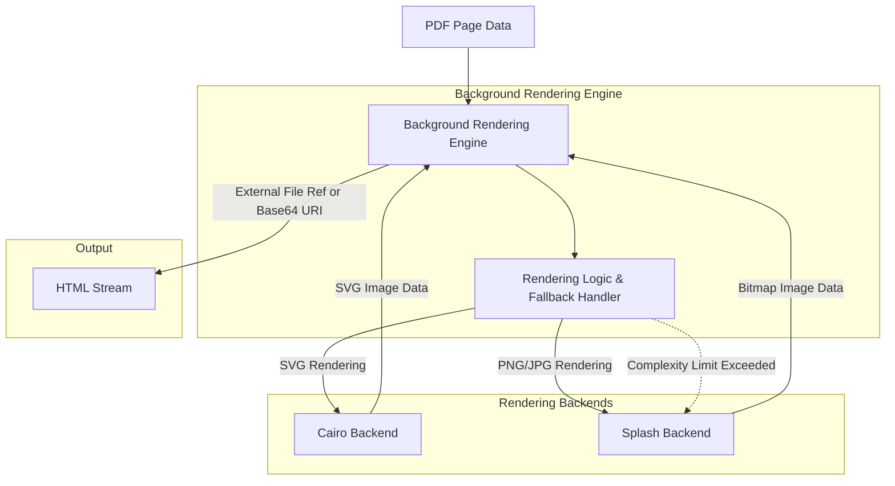

# Background Rendering Engine: Interfaces Documentation

## Subsystem Overview

The Background Rendering Engine is responsible for the visual generation of page backgrounds, specifically focusing on converting PDF pages into image assets to ensure visual fidelity within the system.

From an interfaces perspective, the subsystem acts as a transformation service that takes PDF page data and outputs rendered visual formats. It is designed to integrate with an HTML generation process by providing image data, either as external file references or embedded Base64 data URIs.

### Key Responsibilities
*   **Multi-format Rendering:** Supports rendering PDF pages to SVG (via Cairo backend) or bitmap formats like PNG/JPG (via Splash backend).
*   **Content Delivery:** Manages the integration of rendered images into an HTML stream, supporting both external file linking and Base64 embedding.
*   **Adaptive Fallback:** Implements logic to switch rendering strategies from SVG to bitmap rendering if the complexity of the SVG exceeds configured limits.
*   **Specialized Text Rendering:** Handles specific rendering scenarios including fallback modes, Type 3 fonts, and visual proofing.

## Key Architectural Decisions

Based on the subsystem responsibilities, the following architectural decisions regarding interfaces and integration are evident:

*   **Backend Abstraction:** The engine abstracts the specific rendering technology, utilizing Cairo for vector graphics (SVG) and Splash for raster graphics (PNG/JPG).
*   **Complexity-Based Fallback:** The interface includes logic to monitor rendering complexity. If SVG complexity exceeds a configured threshold, the system automatically falls back to a bitmap rendering approach.
*   **Flexible Embedding Strategy:** The subsystem does not enforce a single method of image delivery. Instead, it supports both external file references and Base64 data URIs for embedding into the HTML stream.

## Cross-Module Relationships

The Background Rendering Engine interacts with the following system components based on the provided documentation:

*   **HTML Stream:** The engine is responsible for managing the embedding of generated images into the HTML stream. This suggests a dependency on a component or process that aggregates the final HTML output.
*   **Rendering Backends:** It directly interfaces with external libraries or subsystems for Cairo and Splash to perform the actual image generation.

## External Dependencies and Integrations

The subsystem relies on the following external technologies for its core functionality:

*   **Cairo:** Used as a backend for rendering to SVG format.
*   **Splash:** Used as a backend for rendering to PNG and JPG formats.

## Interface Definitions

**Status:** Not determined from available documentation.

The provided module documentation for `src/BackgroundRenderer` consists only of a title and summary header. It does not contain explicit definitions for:
*   REST/GraphQL API endpoints or methods.
*   Request or response formats (JSON schemas, XML structures, etc.).
*   Function signatures or class interfaces.
*   WebSocket protocols or event topics.
*   Authentication mechanisms.

Therefore, specific API contracts or integration protocols cannot be documented at this time.

## Data Flow Diagram

The following diagram illustrates the high-level flow of data and integration points based on the subsystem's described responsibilities.

