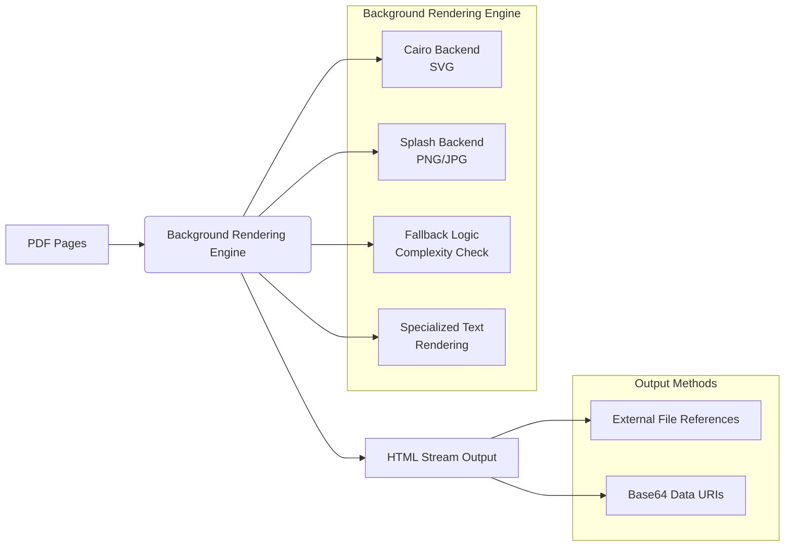

# Background Rendering Engine: Executive Summary

## Executive Summary
The Background Rendering Engine is a specialized subsystem designed to maintain the visual integrity of document pages during processing. Its primary function is to handle the rendering of page backgrounds, ensuring that visual fidelity is preserved when documents are converted or displayed. By generating high-quality representations of pages, the system ensures that the final output accurately reflects the original source material.

The engine provides value by offering flexible rendering options that adapt to different complexity constraints. It supports the generation of images in various formats and manages their integration into HTML streams. This allows for robust document display capabilities that can switch between vector and bitmap representations as needed to balance quality and performance.

## Business Purpose and Goals
Business purpose not explicitly documented in the codebase.

## Key Capabilities and Features
Based on the subsystem responsibilities, the following capabilities are explicitly supported:

*   **Multi-Format PDF Rendering:** Converts PDF pages into specific image formats utilizing different backends: Cairo for SVG generation and Splash for PNG or JPG generation.
*   **HTML Stream Integration:** Manages the embedding of generated images directly into the HTML stream. This includes support for both external file references and Base64 data URIs.
*   **Adaptive Rendering Fallbacks:** Automatically handles rendering complexity by switching from SVG to bitmap rendering if the SVG complexity exceeds configured limits.
*   **Specialized Text Logic:** Executes specific text rendering routines for fallback modes, Type 3 fonts, and visual proofing scenarios.

## Target Audience/Users
Not explicitly documented.

## Business Domain Context
Based on the module names and responsibilities (PDF rendering, HTML stream generation), the subsystem operates within the **document processing and conversion domain**. It specifically addresses the need to transform static document formats (PDF) into web-compatible formats (HTML/Images) while preserving complex visual elements such as backgrounds and specialized fonts.

## High-Level Architecture

The following diagram illustrates the high-level flow of the Background Rendering Engine based on its defined responsibilities:

## Technology Stack Summary
The following technologies are explicitly mentioned within the subsystem responsibilities:

*   **Cairo:** Used as a backend for rendering SVG formats.
*   **Splash:** Used as a backend for rendering PNG and JPG formats.

## Key Metrics or Scale Information
Not determined from available documentation.