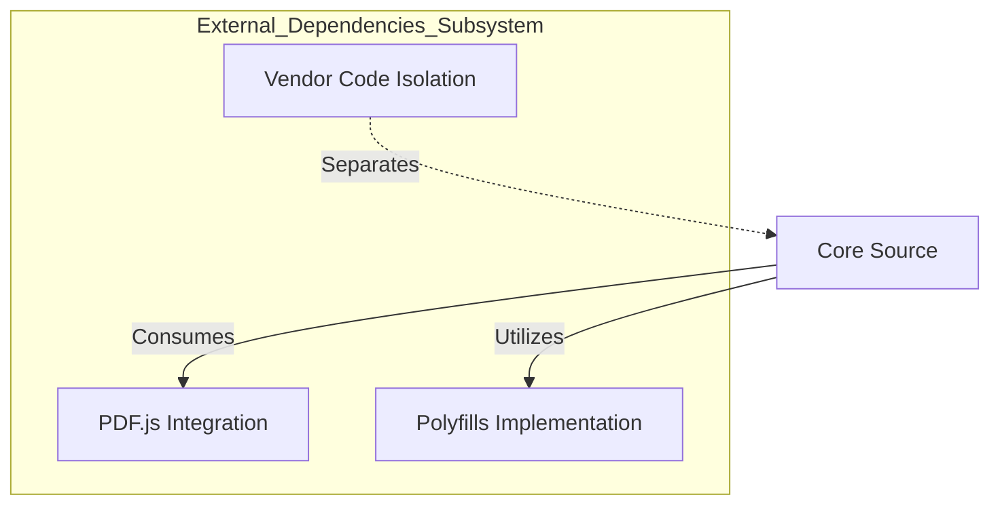

# External Dependencies: Overview

## Executive Summary
The External Dependencies subsystem is responsible for managing the integration of third-party libraries required for specific system functionalities. Its primary purpose is to enable PDF processing capabilities, specifically rendering and manipulation, by leveraging the PDF.js library. Additionally, the subsystem ensures the application functions consistently across different web browsers by implementing polyfills for missing DOM features, such as `classList`.

A key function of this subsystem is the isolation of vendor code from the core application source. This separation is designed to simplify the management of third-party updates and ensure license compliance is handled independently from the main codebase.

## Business Purpose and Goals
Business purpose not explicitly documented in the codebase.

## Key Capabilities and Features
Based on the provided subsystem documentation, the following capabilities are supported:

*   **PDF Rendering and Manipulation:** Provides the underlying functionality to render and manipulate PDF documents using the PDF.js library.
*   **Cross-Browser Compatibility:** Ensures the application operates correctly across various browsers by implementing polyfills for standard DOM features that may be missing in older or different environments.
*   **Vendor Code Isolation:** Maintains a strict separation between third-party vendor code and the core source code to facilitate easier updates and distinct license compliance management.

## Target Audience/Users
Not explicitly documented.

## Business Domain Context
The subsystem operates within a software environment requiring document processing capabilities, specifically for PDF files. The need for cross-browser compatibility indicates the system is a web-based application intended to function reliably across multiple browser platforms.

## High-Level Architecture
The diagram below illustrates the high-level components of the External Dependencies subsystem and their relationship to the Core Source, based on the responsibilities described.

## Technology Stack Summary
The following technology is explicitly referenced in the subsystem documentation:

*   **PDF.js:** A library used for underlying PDF processing (rendering and manipulation).

## Key Architectural Decisions
*   **Vendor Code Isolation:** The decision has been made to isolate vendor code from the core source. This architectural choice is driven by the need to manage updates and handle license compliance separately.

## Cross-Module Relationships
*   **Core Source:** The External Dependencies subsystem provides functionality (PDF rendering and polyfills) to the Core Source while maintaining a separation of concerns through vendor code isolation.

## External Dependencies and Integrations
*   **PDF.js:** The subsystem integrates directly with the PDF.js library to provide PDF rendering and manipulation features.

## Key Metrics or Scale Information
Not determined from available documentation.