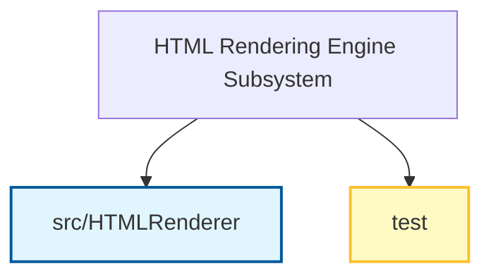

# HTML Rendering Engine: Executive Overview

## Executive Summary
The HTML Rendering Engine is a software component responsible for converting PDF content structures into semantic HTML DOM elements. Its primary function is to transform static PDF data into a web-compatible format, enabling the display and interaction of document content within an HTML environment.

The subsystem handles the complex translation of various PDF elements, including text streams, images, and vector paths, into standard HTML and CSS. Beyond basic rendering, it manages the extraction of embedded fonts to external files and ensures that interactive features, such as hyperlinks and form widgets (inputs and buttons), are preserved and functional in the output.

## Business Purpose and Goals
**Business purpose not explicitly documented in the codebase.** The provided documentation outlines technical responsibilities but does not specify specific business objectives, user needs, or organizational goals.

## Key Capabilities and Features
Based on the subsystem documentation, the following capabilities are explicitly supported:

*   **Graphics State Management:** The system interprets and tracks the PDF graphics state, including transformations, fonts, colors, and clipping paths.
*   **Content Conversion:** It converts PDF text streams, images, and vector paths into HTML/CSS elements.
*   **Font Extraction:** The engine extracts embedded fonts (supporting TrueType, OpenType, and Type1 formats) and dumps them to external files.
*   **Interactive Element Rendering:** It renders interactive components, specifically hyperlinks and form widgets (such as inputs and buttons).

## Target Audience/Users
**Not explicitly documented.** The provided data does not define specific user personas or target audiences.

## Business Domain Context
Inferred from the module names and data models, the subsystem operates within the **document processing and web rendering domain**. It specifically addresses the intersection of PDF document formats and web standards (HTML/CSS), facilitating the transformation of legacy or fixed-layout documents into semantic web structures.

## High-Level Architecture
The following diagram represents the modules explicitly identified within the subsystem documentation.

## Technology Stack Summary
**No specific technologies are listed** in the provided subsystem information.

## Key Metrics or Scale Information
**Not determined from available documentation.** No configuration or code details regarding scale, performance metrics, or volume were provided.

## Architectural Decisions and Relationships
*   **Key Architectural Decisions:** Not determined from available documentation.
*   **Cross-module Relationships:** Not determined from available documentation.
*   **External Dependencies and Integrations:** Not determined from available documentation.