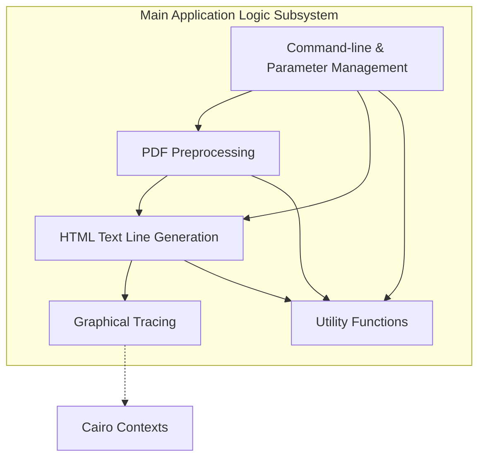

# Main Application Logic: Executive Summary

## Executive Summary

The Main Application Logic subsystem functions as the central orchestrator for a document rendering pipeline. Its primary role is to coordinate the end-to-end processing of documents, managing the flow from initial input analysis through to the generation of output. The subsystem handles the essential preparation steps required before full rendering, such as scanning PDF files for font usage and determining page dimensions. By establishing these parameters early in the process, it ensures that subsequent rendering stages operate with accurate data.

In addition to orchestration, the subsystem provides core capabilities for generating and optimizing HTML text lines. It manages the state and clipping logic necessary for accurate text representation and utilizes graphical tracing to verify text visibility and occlusion. The system also interfaces directly with users through command-line argument parsing, allowing for the management of global parameters that control application behavior. Through these combined responsibilities, the Main Application Logic subsystem ensures the structured execution of rendering tasks and the efficient management of system resources.

## Business Purpose and Goals

Business purpose not explicitly documented in the codebase.

## Key Capabilities and Features

Based on the provided subsystem documentation, the following capabilities are supported:

*   **PDF Preprocessing:** Scans documents to identify font usage and determine page dimensions prior to the full rendering process.
*   **HTML Text Line Generation:** Generates and optimizes HTML text lines, incorporating logic for state management and clipping.
*   **Graphical Tracing:** Detects text visibility and occlusion by utilizing Cairo contexts for graphical analysis.
*   **Global Parameter Management:** Parses command-line arguments and manages global parameters to control application behavior.
*   **Utility Operations:** Provides essential support functions, including Base64 encoding, string formatting, and the cleanup of temporary files.

## Target Audience/Users

Not explicitly documented.

## Business Domain Context

The subsystem operates within the technical domain of document processing and rendering. It specifically handles the transformation and analysis of PDF data, converting elements into HTML text lines and performing graphical checks. The use of "Cairo contexts" indicates a reliance on 2D graphics libraries for visual verification tasks.

## High-Level Architecture

The following diagram illustrates the high-level components within the Main Application Logic subsystem based on its defined responsibilities.

## Technology Stack Summary

The following technologies are explicitly referenced within the subsystem documentation:

*   **Cairo:** Referenced in the context of graphical tracing for detecting text visibility and occlusion.

## Key Metrics or Scale Information

Not determined from available documentation.