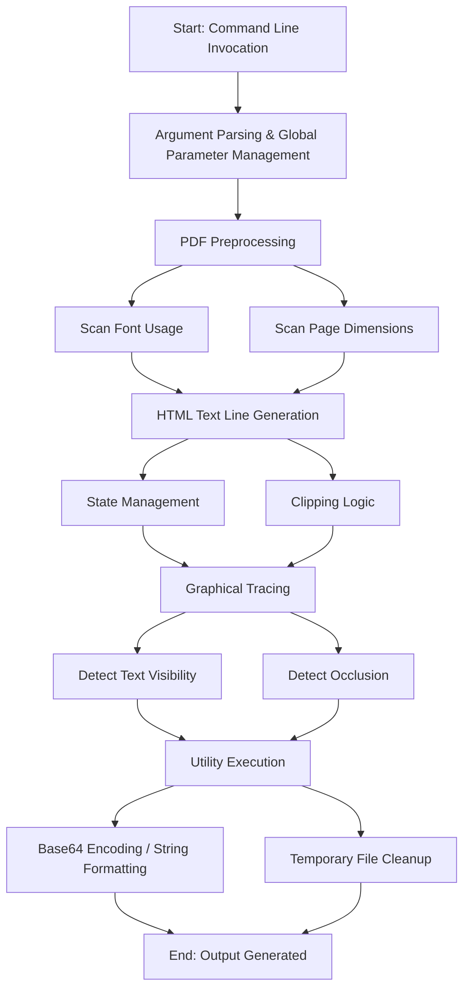

# Use Cases Documentation: Main Application Logic

## Subsystem Overview
The **Main Application Logic** subsystem serves as the primary orchestrator for the system's core functionality. From a user and workflow perspective, this subsystem acts as the entry point for the application, managing the execution of the rendering pipeline. It is responsible for accepting inputs via command-line arguments and coordinating the transformation of PDF documents through various stages of processing, including analysis, text line generation, and graphical tracing.

## User Roles and Personas
**Not explicitly defined in code.** The documentation does not specify user roles (e.g., Admin, End User) or personas. The only interaction described is through command-line argument parsing, implying a generic CLI user.

## Key User Journeys and Workflows

Based on the subsystem responsibilities, the primary workflow involves a user or system invoking the application via the command line to process a document.

### 1. Document Rendering Workflow
The user triggers the application by executing the main entry point with specific arguments. The system then executes the rendering pipeline:

1.  **Initialization:** The system parses command-line arguments to configure global parameters.
2.  **Preprocessing:** The system scans the input PDF document to gather metadata (font usage, page dimensions) prior to the full rendering process.
3.  **Content Generation:** The system generates and optimizes HTML text lines, managing state and clipping logic.
4.  **Graphical Analysis:** The system performs graphical tracing to determine text visibility and detect occlusions using Cairo contexts.
5.  **Cleanup:** The system performs utility functions such as cleaning up temporary files.

## Business Process Flows

The subsystem implements a linear business process for document conversion and analysis:

## Feature Descriptions

From a functional perspective, the subsystem provides the following features:

*   **Command-Line Interface:** Provides the capability to parse command-line arguments and manage global parameters for the application session.
*   **PDF Analysis:** Performs a preliminary scan of PDF files to extract font usage data and page dimensions before initiating the heavy rendering process.
*   **HTML Text Optimization:** Generates HTML text lines with optimization logic, handling specific requirements for state management and clipping regions.
*   **Visibility Detection:** Utilizes graphical tracing (via Cairo contexts) to analyze the rendered output, identifying which text elements are visible and which are occluded by other graphical elements.
*   **System Utilities:** Provides auxiliary functions for data formatting (Base64, strings) and system maintenance (temporary file cleanup).

## Architectural Decisions

*   **Orchestration Strategy:** The subsystem is designed as the central coordinator ("primary orchestration logic"), managing the sequence of operations from preprocessing to rendering.
*   **Pre-rendering Analysis:** The architecture explicitly separates PDF preprocessing (scanning fonts and dimensions) from the full rendering pipeline to optimize or prepare the process.
*   **Contextual Graphing:** The system integrates graphical tracing directly into the logic flow to handle occlusion detection, likely to ensure the accuracy of the text output.

## Cross-Module Relationships
**Not determined from available documentation.** The provided text describes the responsibilities of this subsystem but does not explicitly name other modules, services, or components it interacts with.

## External Dependencies and Integrations

Based on the provided responsibilities, the subsystem integrates with the following external technology:

*   **Cairo:** Used for graphical contexts to perform tracing, specifically for detecting text visibility and occlusion.

## Edge Cases and Error Handling
**Not determined from available documentation.** While "clipping logic" is mentioned as a responsibility, specific error paths or exception handling scenarios are not detailed in the provided text.

## Permission and Access Control Scenarios
**Not determined from available documentation.** No authorization or authentication logic is mentioned in the subsystem description.