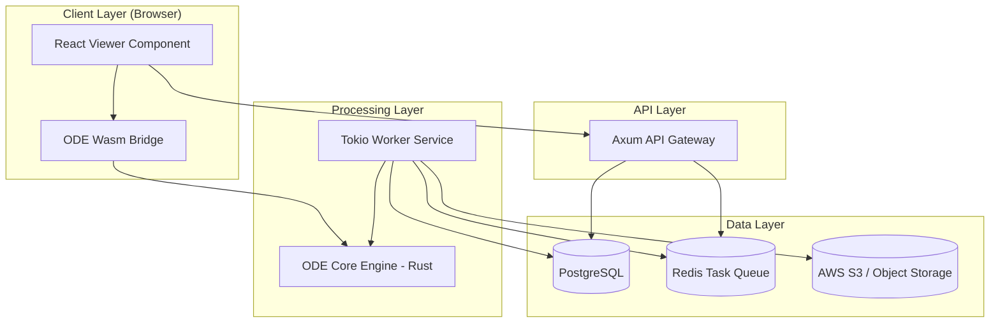

# Architecture Specification: Component Specifications (ODE)

This document defines the detailed technical specifications for the major components of the **Oxidized Document Engine (ODE)**.

---

## 1. System Overview & Component Map

The ODE is structured as a distributed system with a shared core library. The architecture supports both server-side batch processing and client-side WebAssembly execution.

---

## 2. Component: `ode-core` (The Transformation Engine)

### Name: `ode-core`
**Responsibility**: The primary library responsible for parsing PDF binary data, extracting glyphs/fonts, and generating semantic HTML5/SVG/CSS. It must maintain pixel-perfect fidelity while ensuring memory safety.

**Interfaces**:
- `pub fn convert_pdf(data: Vec<u8>, options: ConvertOptions) -> Result<OutputBundle, OdeError>`
- `trait ResourceProcessor`: Interface for handling fonts and images.

**Dependencies**:
- `pdf`: Low-level PDF parsing.
- `font-kit`: Font analysis and subsetting.
- `resvg / tiny-skia`: Vector graphics rendering.
- `serde`: Serialization of configuration.

**Files to Create/Modify**:
- `crates/ode-core/src/lib.rs`: Entry point.
- `crates/ode-core/src/parser/`: PDF structure traversal.
- `crates/ode-core/src/renderer/`: HTML/SVG generation logic.
- `crates/ode-core/src/fonts/`: Font extraction and WOFF2 conversion.

### Implementation Checklist
- [ ] Implement `PdfParser` using `pdf` crate to extract page trees and content streams.
- [ ] Create `FontManager` to handle CID-keyed fonts and TrueType embedding.
- [ ] Implement `HtmlCanvas` to map PDF coordinate systems to CSS absolute positioning.
- [ ] Integrate `resvg` for converting complex PDF paths to optimized SVGs.

### Verification
- **Acceptance Criteria**: 
    - Successfully converts a 100-page PDF with < 1% visual regression compared to `pdf2htmlEX`.
    - Zero `unsafe` blocks in the rendering logic.
- **Test Cases**:
    - `test_font_subsetting`: Verify generated WOFF2 files contain only used glyphs.
    - `test_coordinate_mapping`: Verify a 100x100 PDF point maps correctly to CSS pixels.

---

## 3. Component: `ode-worker` (Background Processor)

### Name: `ode-worker`
**Responsibility**: A headless service that consumes transformation jobs from Redis, executes the `ode-core` engine, and manages the persistence of results.

**Interfaces**:
- Redis Stream Consumer (Group: `worker-group`).
- S3 Multipart Upload Client.

**Dependencies**:
- `tokio`: Async runtime.
- `deadpool-redis`: Connection pooling.
- `aws-sdk-s3`: Storage integration.
- `ode-core`: The transformation logic.

**Files to Create/Modify**:
- `crates/ode-worker/src/main.rs`: Worker loop.
- `crates/ode-worker/src/storage.rs`: S3 integration logic.
- `crates/ode-worker/src/processor.rs`: Job execution wrapper.

### Implementation Checklist
- [ ] Implement exponential backoff for Redis connection failures.
- [ ] Create a "Heartbeat" mechanism to update job status in PostgreSQL every 5 seconds.
- [ ] Implement graceful shutdown (SIGTERM) to allow current jobs to finish.

### Verification
- **Acceptance Criteria**:
    - Worker recovers automatically from a lost Redis connection.
    - Successfully processes 50 concurrent jobs without memory leaks (> 2GB).
- **Test Cases**:
    - `test_job_failure_state`: Kill a worker mid-job and verify the job is re-queued or marked "Failed" in DB.

---

## 4. Component: `ode-api` (Gateway Service)

### Name: `ode-api`
**Responsibility**: Provides a RESTful interface for users to upload PDFs, check job status, and retrieve signed URLs for converted assets.

**Interfaces**:
- `POST /v1/jobs`: Submit PDF for conversion.
- `GET /v1/jobs/{id}`: Poll status.
- `GET /v1/jobs/{id}/download`: Get signed S3 URL.

**Dependencies**:
- `axum`: Web framework.
- `sqlx`: PostgreSQL interaction.
- `tower-http`: Middleware (CORS, Trace, Auth).

**Files to Create/Modify**:
- `crates/ode-api/src/routes/jobs.rs`: Job handlers.
- `crates/ode-api/src/auth.rs`: JWT validation.
- `migrations/`: SQL schema for jobs table.

### Implementation Checklist
- [ ] Implement multipart upload handler with file size limits (max 500MB).
- [ ] Integrate `OpenTelemetry` middleware for request tracing.
- [ ] Implement Rate Limiting using Redis (fixed window).

### Verification
- **Acceptance Criteria**:
    - API responds within < 200ms for status checks.
    - Unauthorized requests (missing JWT) return 401.
- **Test Cases**:
    - `test_rate_limiting`: Send 101 requests in 1 minute and verify 429 response.

---

## 5. Component: `ode-wasm` (Client-Side Bridge)

### Name: `ode-wasm`
**Responsibility**: Compiles `ode-core` into WebAssembly to allow in-browser conversion, reducing server costs for small documents.

**Interfaces**:
- `async function convert(buffer: Uint8Array): Promise<Object>` (JavaScript API).

**Dependencies**:
- `wasm-bindgen`: Rust-JS interop.
- `js-sys`: JS global bindings.
- `web-sys`: Browser API access (for console logging/performance).

**Files to Create/Modify**:
- `crates/ode-wasm/src/lib.rs`: Wasm exports.
- `crates/ode-wasm/Cargo.toml`: Wasm-specific target config.

### Implementation Checklist
- [ ] Optimize binary size using `wasm-opt` (Target < 2MB).
- [ ] Implement `WasmResourceResolver` to handle font loading via browser Fetch API.

### Verification
- **Acceptance Criteria**:
    - Wasm module loads and executes in Chrome, Firefox, and Safari.
    - Memory usage remains under 512MB for a 10MB PDF.
- **Test Cases**:
    - `test_browser_render`: Convert a 1-page PDF in a headless browser and verify HTML output existence.

---

## 6. Component: `ode-ui` (React Viewer)

### Name: `ode-ui`
**Responsibility**: A set of React components for displaying the converted HTML/SVG content with support for zooming, searching, and text selection.

**Interfaces**:
- `<DocumentViewer src={jobUrl} onPageChange={fn} />`

**Dependencies**:
- `Radix UI`: Accessible primitives.
- `Tailwind CSS`: Styling.
- `Lucide React`: Icons.

**Files to Create/Modify**:
- `ui/src/components/Viewer/`: Core viewer logic.
- `ui/src/hooks/useOdeJob.ts`: Hook for polling API.

### Implementation Checklist
- [ ] Implement "Virtual Scrolling" to handle 1000+ page documents efficiently.
- [ ] Add WCAG 2.1 AA compliant keyboard navigation for page turning.

### Verification
- **Acceptance Criteria**:
    - First Contentful Paint (FCP) of a document page < 500ms.
    - Screen readers correctly identify text content in the generated HTML.
- **Test Cases**:
    - `test_zoom_levels`: Verify CSS transforms update correctly on zoom button click.

---

## 7. Global Verification & Integration Scenarios

### Integration Test Scenario: End-to-End Conversion
1.  **Step**: User uploads `test.pdf` via `ode-ui`.
2.  **Step**: `ode-api` stores metadata in Postgres and pushes task to Redis.
3.  **Step**: `ode-worker` picks up task, runs `ode-core`.
4.  **Step**: Resulting HTML/CSS/Fonts are uploaded to S3.
5.  **Step**: `ode-worker` updates Postgres to `COMPLETED`.
6.  **Step**: `ode-ui` polls API, receives status, and renders the document from S3.

### Performance Benchmark
- [ ] **Throughput**: System must handle 10 concurrent conversions per worker instance.
- [ ] **Latency**: 5MB PDF must be converted in < 3 seconds (server-side).

### Security Audit
- [ ] **Memory Safety**: Run `cargo-audit` on all dependencies.
- [ ] **Sandbox**: Verify `ode-worker` runs as a non-root user in Docker.