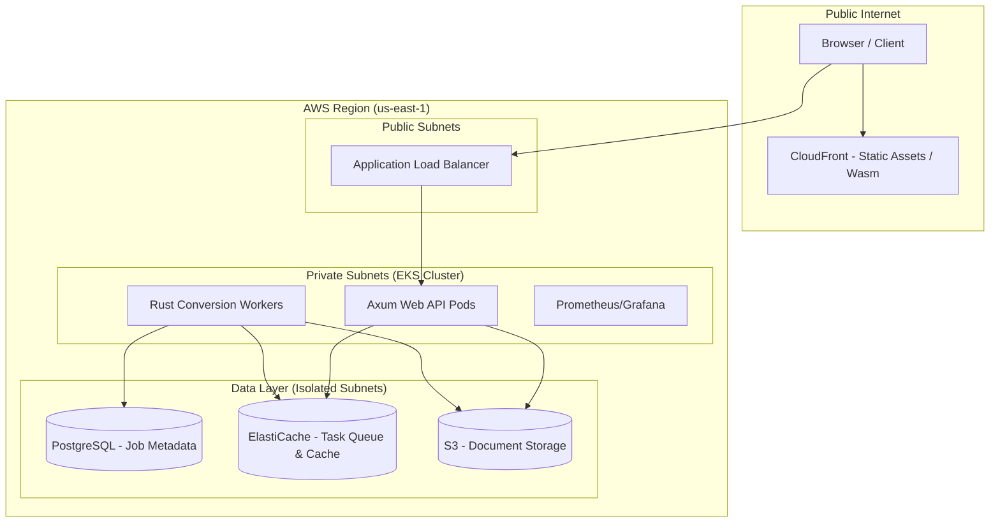

# Architecture Specification: Infrastructure & Deployment
**Project**: Oxidized Document Engine (ODE)  
**Status**: Draft | **Version**: 1.0  
**Scope**: Deployment topology, AWS Infrastructure, Scaling Strategy, and CI/CD.

---

## 1. System Overview & Deployment Topology

The Oxidized Document Engine (ODE) follows a **Hybrid Cloud-Edge Architecture**. High-throughput batch processing occurs on AWS EKS, while interactive, low-latency rendering is offloaded to the client via WebAssembly (Wasm).

### 1.1 Deployment Diagram (Mermaid)

---

## 2. Infrastructure Requirements

### 2.1 Compute Resources (EKS)
*   **Instance Type**: `c6i.xlarge` (Compute Optimized). Rust compilation and PDF parsing are CPU-intensive.
*   **Node Groups**: 
    *   `system-pool`: T3.medium (Core DNS, Metrics Server).
    *   `worker-pool`: C6i.xlarge (API and Conversion Workers).
*   **Runtime**: Containerd (Docker-compatible).

### 2.2 Storage
*   **S3**: Bucket for raw PDF uploads and generated HTML outputs.
    *   *Policy*: Lifecycle rule to move objects to Glacier after 30 days.
*   **PostgreSQL (RDS)**: 
    *   *Instance*: `db.t4g.medium`.
    *   *Purpose*: Job status tracking, user metadata, conversion logs.
*   **Redis (ElastiCache)**: 
    *   *Instance*: `cache.t4g.small`.
    *   *Purpose*: Task queue for asynchronous conversion jobs.

### 2.3 Networking
*   **VPC**: 3 Availability Zones (AZs).
*   **Subnets**: Public (ALB), Private (EKS), Isolated (RDS/Redis).
*   **Security Groups**: 
    *   API: Allow 80/443 from ALB.
    *   RDS: Allow 5432 from EKS Private Subnets only.

---

## 3. Scaling Strategy

### 3.1 Horizontal Pod Autoscaler (HPA)
*   **API Layer**: Scales based on **Request Count Per Target** (> 500 req/min).
*   **Worker Layer**: Scales based on **Custom Metric** (Redis Queue Depth). If queue > 50 items, spin up new worker pods.

### 3.2 Cluster Autoscaler
*   Triggered when pods are in `Pending` state due to insufficient CPU/Memory in the node group.

### 3.3 Client-Side Scaling (Wasm)
*   The system scales infinitely for "Viewer" requests by serving the `.wasm` engine via CloudFront, offloading the CPU cost of rendering to the end-user's hardware.

---

## 4. Components

### Component 1: Terraform Infrastructure (IaC)
- **Name**: `ode-infra-core`
- **Responsibility**: Provisioning VPC, EKS, RDS, and S3.
- **Interfaces**: Terraform Outputs (Cluster ARN, DB Endpoint).
- **Files to Create**:
    - `infra/terraform/vpc.tf`: Network topology.
    - `infra/terraform/eks.tf`: EKS Cluster and Node Groups.
    - `infra/terraform/rds.tf`: PostgreSQL configuration.
    - `infra/terraform/s3.tf`: Document storage buckets.

### Component 2: Kubernetes Manifests
- **Name**: `ode-k8s-workloads`
- **Responsibility**: Defining pod specs, services, and autoscaling.
- **Dependencies**: Container images in ECR.
- **Files to Create**:
    - `k8s/base/api-deployment.yaml`: Axum API definition.
    - `k8s/base/worker-deployment.yaml`: Rust worker definition.
    - `k8s/base/hpa.yaml`: Autoscaling rules.
    - `k8s/base/service.yaml`: Load balancer service.

### Component 3: CI/CD Pipeline
- **Name**: `ode-github-actions`
- **Responsibility**: Automate testing, Docker builds, and deployment.
- **Files to Create**:
    - `.github/workflows/ci.yml`: Rust linting, testing, and Wasm build.
    - `.github/workflows/cd.yml`: Docker push to ECR and `kubectl apply`.

---

## 5. Implementation Checklist

### Infrastructure Setup
- [ ] **VPC & Networking**: Configure 3-tier VPC with NAT Gateways.
    - *Success Criteria*: Private subnets cannot be reached from the internet; NAT allows outbound traffic.
- [ ] **EKS Cluster**: Provision EKS with OIDC provider for IAM Roles for Service Accounts (IRSA).
    - *Success Criteria*: `kubectl get nodes` returns ready status.
- [ ] **Data Layer**: Provision RDS and ElastiCache.
    - *Success Criteria*: API pods can connect via environment variable connection strings.

### Deployment Automation
- [ ] **Dockerization**: Create multi-stage Dockerfiles for Rust (using `cargo-chef` for caching).
    - *Success Criteria*: Image size < 200MB.
- [ ] **Helm/Kustomize**: Template the K8s manifests for dev/staging/prod environments.
    - *Success Criteria*: `kustomize build .` generates valid YAML for each env.
- [ ] **GitHub Actions**: Implement the pipeline.
    - *Success Criteria*: Merges to `main` trigger a rolling update in the `staging` namespace.

---

## 6. Verification & Testing

### 6.1 Acceptance Criteria
1.  **High Availability**: The system must survive the termination of a single AWS AZ without downtime.
2.  **Performance**: The API must respond to health checks within < 50ms.
3.  **Scalability**: Worker pods must scale from 1 to 10 within 120 seconds of a queue spike (1000+ jobs).
4.  **Security**: RDS must not have a public IP address.

### 6.2 Test Cases

| ID | Scenario | Expected Outcome |
|:---|:---|:---|
| TC-01 | **Scale Up on Load** | Inject 500 dummy jobs into Redis. Observe HPA spinning up new `ode-worker` pods. |
| TC-02 | **Database Failover** | Trigger a manual RDS failover. API should reconnect within the defined retry window (Tokio/SQLx). |
| TC-03 | **Wasm Delivery** | Request `engine.wasm` from CloudFront. Verify `Content-Encoding: br` (Brotli) and `Cache-Control` headers. |
| TC-04 | **Zero-Downtime Deploy** | Run `kubectl rollout restart`. Perform continuous `curl` requests; verify 0% packet loss. |

### 6.3 Verification Steps
1.  **Infra Check**: Run `terraform plan` to ensure state matches requirements.
2.  **Security Audit**: Run `kube-bench` on EKS nodes to verify CIS benchmarks.
3.  **Load Test**: Use `k6` or `Locust` to simulate 100 concurrent PDF conversions and monitor Prometheus metrics in Grafana.