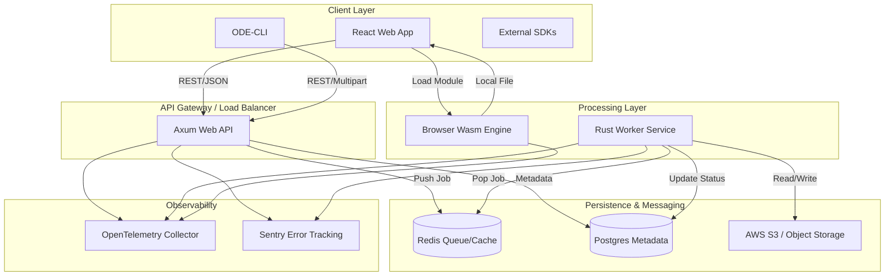

# Integration Architecture Specification: Oxidized Document Engine (ODE)

This document defines the integration patterns, API contracts, and communication protocols for the Oxidized Document Engine (ODE). It focuses on bridging the high-performance Rust core with external consumers, cloud infrastructure, and the browser-based WebAssembly runtime.

---

## 1. System Communication Overview

The ODE employs three primary integration patterns:
1.  **Synchronous REST (Control Plane):** For job submission, status polling, and configuration.
2.  **Asynchronous Task Queue (Data Plane):** For decoupled, high-throughput document processing.
3.  **Wasm Shared Memory (Edge Plane):** For near-native performance within the browser environment.

### 1.1 Integration Diagram (Mermaid)



---

## 2. Component Specifications

### 2.1 API Gateway (Axum Service)
*   **Name**: `ode-api-server`
*   **Responsibility**: Entry point for all external traffic. Handles authentication, file upload validation, and job orchestration.
*   **Interfaces**:
    *   `POST /v1/jobs`: Accepts PDF multipart upload or S3 URL. Returns `job_id`.
    *   `GET /v1/jobs/{id}`: Returns status (Pending, Processing, Completed, Failed).
    *   `GET /v1/jobs/{id}/download`: Redirects to pre-signed S3 URL for HTML output.
*   **Dependencies**: `PostgreSQL` (Job state), `Redis` (Queueing), `AWS S3` (Storage).
*   **Files to Create/Modify**:
    *   `src/api/routes/jobs.rs`: Route handlers.
    *   `src/api/middleware/auth.rs`: JWT validation.
    *   `src/api/dto/request.rs`: Request/Response schemas.

### 2.2 Background Worker (Rust/Tokio)
*   **Name**: `ode-worker`
*   **Responsibility**: Consumes tasks from Redis, invokes the `rust-pdf2html` core engine, and manages document lifecycle.
*   **Interfaces**:
    *   `Redis BLPOP`: Listens on `ode_job_queue`.
*   **Dependencies**: `rust-pdf2html` (Core), `S3` (Input/Output), `PostgreSQL` (Finalizing status).
*   **Files to Create/Modify**:
    *   `src/worker/main.rs`: Worker loop logic.
    *   `src/worker/processor.rs`: Integration with the Rust conversion core.

### 2.3 WebAssembly Bridge (TypeScript/Rust)
*   **Name**: `ode-wasm-client`
*   **Responsibility**: Provides a high-level JS/TS interface to the Rust conversion logic running in-browser.
*   **Interfaces**:
    *   `convertPdf(buffer: ArrayBuffer, options: Config): Promise<ConversionResult>`
*   **Dependencies**: `wasm-bindgen`, `js-sys`.
*   **Files to Create/Modify**:
    *   `wasm/src/lib.rs`: Rust entry point for Wasm.
    *   `packages/sdk/src/wasm-bridge.ts`: TypeScript wrapper.

---

## 3. Communication Patterns & Protocols

| Pattern | Protocol | Data Format | Use Case |
| :--- | :--- | :--- | :--- |
| **External API** | HTTPS (REST) | JSON / Multipart | Job submission and management. |
| **Internal Messaging** | Redis Protocol | MessagePack | Task distribution to workers. |
| **Storage Access** | S3 API | Binary Stream | PDF input and HTML/CSS/JS output. |
| **Telemetry** | OTLP/gRPC | Protobuf | Metrics and Traces to Prometheus/Grafana. |
| **Wasm Interop** | Linear Memory | Uint8Array | Passing PDF bytes between JS and Rust. |

---

## 4. Implementation Checklist

### 4.1 External API Development
- [ ] **REST API Implementation**: Create Axum handlers for job lifecycle.
    - *Success Criteria*: `POST /v1/jobs` returns 202 Accepted with a valid UUID.
- [ ] **Multipart Handling**: Implement streaming file upload to S3.
    - *Success Criteria*: Files > 50MB uploaded without memory spikes (using `axum::extract::Multipart`).
- [ ] **OpenAPI Documentation**: Generate `openapi.yaml` using `utoipa`.
    - *Success Criteria*: Swagger UI accessible at `/swagger-ui`.

### 4.2 Asynchronous Integration
- [ ] **Redis Producer**: Implement job enqueuing in the API layer.
    - *Success Criteria*: Messages in Redis contain `job_id` and `s3_path`.
- [ ] **Redis Consumer**: Implement the worker polling logic with exponential backoff.
    - *Success Criteria*: Worker successfully picks up jobs and updates Postgres to `processing`.

### 4.3 Wasm Integration
- [ ] **Wasm Module Compilation**: Configure `wasm-pack` build pipeline.
    - *Success Criteria*: `.wasm` file size is < 5MB (compressed).
- [ ] **JS Bridge**: Create the TypeScript `ODEClient` class.
    - *Success Criteria*: Web application can convert a 1-page PDF locally in < 500ms.

---

## 5. Verification & Testing

### 5.1 Acceptance Criteria
1.  **End-to-End Latency**: A 10-page PDF must be converted and available for download via API in < 3 seconds (Server-side).
2.  **Reliability**: The system must recover from a Worker crash; Redis visibility timeouts must return the job to the queue.
3.  **Security**: All API endpoints (except `/health`) must require a valid `Authorization: Bearer <JWT>` header.
4.  **Observability**: Every conversion job must generate a unique `trace_id` visible in Grafana Tempo.

### 5.2 Test Cases

| Test ID | Scenario | Expected Outcome |
| :--- | :--- | :--- |
| **TC-INT-01** | Submit PDF via API | Job status moves `Pending` -> `Processing` -> `Completed`. |
| **TC-INT-02** | Worker Failure | Job is re-queued by Redis after visibility timeout (300s). |
| **TC-INT-03** | Wasm Conversion | Browser-side conversion produces HTML matching server-side output. |
| **TC-INT-04** | Invalid JWT | API returns `401 Unauthorized` for job submission. |
| **TC-INT-05** | S3 Connectivity Loss | Worker logs `ERROR` to Sentry and retries 3 times before failing job. |

### 5.3 Verification Steps
1.  **API Verification**: 
    ```bash
    curl -X POST http://localhost:8080/v1/jobs -H "Authorization: Bearer $TOKEN" -F "file=@test.pdf"
    # Capture job_id, then poll:
    curl http://localhost:8080/v1/jobs/$JOB_ID
    ```
2.  **Infrastructure Verification**:
    *   Check Redis: `LLEN ode_job_queue` should decrement as workers process.
    *   Check Postgres: `SELECT status FROM jobs WHERE id = '$JOB_ID'` should be 'Completed'.
3.  **Observability Verification**:
    *   Open Prometheus and query `ode_conversion_duration_seconds_bucket`.
    *   Verify Sentry receives a test exception triggered by `GET /v1/debug/error`.

---

## 6. Dependencies
*   **Pre-requisites**: 
    *   PostgreSQL schema migrated (`/migrations`).
    *   Redis instance reachable.
    *   AWS IAM roles configured for S3 bucket access.
*   **Post-requisites**:
    *   React Frontend integration with `ode-wasm-client` SDK.
    *   Load testing via k6 to determine optimal Worker replica count.