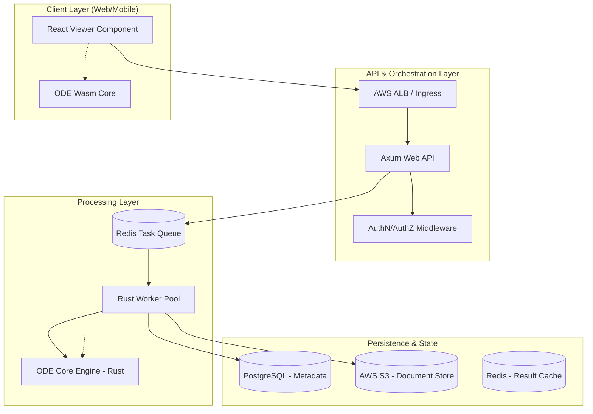

# Architecture Specification: Oxidized Document Engine (ODE) System Overview

## 1. Executive Summary
The Oxidized Document Engine (ODE) is a high-performance, memory-safe modernization of `pdf2htmlEX`. It transitions from a legacy C++ codebase to a modular Rust-based architecture capable of running both as a scalable server-side microservice and a client-side WebAssembly (Wasm) module.

## 2. System Architecture Diagram

---

## 3. Component Specifications

### 3.1 ODE Core Engine (`ode-core`)
- **Name**: `ode-core`
- **Responsibility**: The foundational library responsible for PDF parsing, font extraction, and semantic HTML/SVG generation.
- **Interfaces**: 
    - Internal Rust API: `convert_pdf(input: Vec<u8>, options: Config) -> Result<Output, Error>`
    - Traits for Resource Loading (Fonts, Images).
- **Dependencies**: `lopdf` or `pdf-rs` (parsing), `font-kit` (font processing), `resvg` (vector handling).
- **Files to Create**:
    - `crates/ode-core/src/lib.rs` (Main entry)
    - `crates/ode-core/src/parser/` (PDF structure analysis)
    - `crates/ode-core/src/renderer/` (HTML/SVG generation logic)

### 3.2 ODE Web API (`ode-api`)
- **Name**: `ode-api`
- **Responsibility**: RESTful interface for job submission, status tracking, and document management.
- **Interfaces**:
    - `POST /v1/convert`: Upload PDF, returns `job_id`.
    - `GET /v1/status/:job_id`: Returns processing state.
    - `GET /v1/documents/:doc_id`: Retrieves converted HTML/Assets.
- **Dependencies**: `axum`, `tokio`, `serde`, `sqlx` (Postgres).
- **Files to Create**:
    - `crates/ode-api/src/main.rs` (Server bootstrap)
    - `crates/ode-api/src/routes/` (Endpoint handlers)
    - `crates/ode-api/src/models/` (Request/Response schemas)

### 3.3 ODE Worker (`ode-worker`)
- **Name**: `ode-worker`
- **Responsibility**: Asynchronous consumer that pulls jobs from Redis and executes the `ode-core` conversion.
- **Interfaces**:
    - Redis Pub/Sub or Streams consumer.
- **Dependencies**: `ode-core`, `deadpool-redis`, `aws-sdk-s3`.
- **Files to Create**:
    - `crates/ode-worker/src/main.rs` (Worker loop)
    - `crates/ode-worker/src/processor.rs` (Conversion orchestration)

### 3.4 ODE Wasm (`ode-wasm`)
- **Name**: `ode-wasm`
- **Responsibility**: WebAssembly wrapper allowing the core engine to run in-browser.
- **Interfaces**:
    - JS/TS Bindings: `async function convert(buffer: Uint8Array): Promise<string>`
- **Dependencies**: `wasm-bindgen`, `js-sys`, `ode-core`.
- **Files to Create**:
    - `crates/ode-wasm/src/lib.rs` (Wasm entry point)
    - `packages/ode-wasm-bridge/` (TypeScript definitions)

### 3.5 React Viewer Component (`ode-react`)
- **Name**: `ode-react`
- **Responsibility**: High-fidelity UI component for rendering the output of the conversion engine with zoom, search, and text selection.
- **Interfaces**:
    - React Props: `<DocumentViewer src={jobId} mode="server|local" />`
- **Dependencies**: `react`, `radix-ui`, `tailwind-css`.
- **Files to Create**:
    - `packages/viewer/src/components/DocumentViewer.tsx`
    - `packages/viewer/src/hooks/useConversion.ts`

---

## 4. Implementation Checklist

### Phase 1: Core & Wasm (The Engine)
- [ ] **Core Engine Skeleton**: Implement `ode-core` with basic PDF text extraction.
    - *Success Criteria*: A CLI tool can read a PDF and output a raw text file.
- [ ] **Wasm Compilation**: Configure `wasm-pack` for `ode-core`.
    - *Success Criteria*: A browser console logs "Hello from ODE Rust" using the Wasm module.
- [ ] **Font Handling**: Implement font subsetting and WOFF2 generation in Rust.
    - *Success Criteria*: Converted HTML renders custom PDF fonts without system installation.

### Phase 2: Server-Side Infrastructure
- [ ] **API Layer**: Build Axum server with PostgreSQL integration.
    - *Success Criteria*: `POST /convert` saves metadata to Postgres and returns a UUID.
- [ ] **Worker Pattern**: Implement Redis-backed task queue.
    - *Success Criteria*: Worker picks up a job, converts it, and uploads the result to S3.
- [ ] **Observability**: Integrate OpenTelemetry and Prometheus metrics.
    - *Success Criteria*: Grafana shows "Jobs Processed Per Second" and "Average Latency".

### Phase 3: Frontend & UI
- [ ] **React Component**: Create the `DocumentViewer` using Radix UI primitives.
    - *Success Criteria*: Component renders a multi-page document with a functional sidebar.
- [ ] **Visual Regression Setup**: Configure Playwright for visual testing.
    - *Success Criteria*: Automated tests detect >1% pixel variance between original PDF and HTML.

---

## 5. Verification & Testing

### 5.1 Acceptance Criteria
1. **Memory Safety**: Zero `unsafe` blocks in `ode-core` unless strictly required for FFI with audited libraries.
2. **Performance**: Server-side conversion of a 10-page document must complete in < 2 seconds (p95).
3. **Fidelity**: HTML output must maintain 99% visual parity with the source PDF (text position, font weight, image scaling).
4. **Accessibility**: Generated HTML must pass WCAG 2.1 AA contrast and screen-reader tests.

### 5.2 Test Cases
| ID | Scenario | Expected Outcome |
|----|----------|------------------|
| TC-01 | Upload 50MB PDF with complex vectors | Worker processes without OOM; S3 contains HTML + SVG assets. |
| TC-02 | Client-side Wasm conversion | Browser converts 1-page PDF locally in < 500ms without network calls. |
| TC-03 | Concurrent Job Handling | 100 simultaneous conversion requests are queued in Redis and processed by 5 workers. |
| TC-04 | Font Extraction | PDF with embedded "Comic Sans" results in a valid WOFF2 file and `@font-face` CSS. |

### 5.3 Verification Steps
1. **Local Dev**: Run `cargo test` in `crates/ode-core` to verify parsing logic.
2. **Integration**: Run `docker-compose up` and use Postman to hit `POST /v1/convert`.
3. **End-to-End**: Open the React example app, upload a PDF, and verify visual layout against Chrome's native PDF viewer.
4. **Infrastructure**: Run `terraform plan` to verify EKS and RDS resource definitions.

## 6. Dependencies & Sequencing
1. **Prerequisite**: `ode-core` must reach "Alpha" (text/layout extraction) before `ode-worker` or `ode-wasm` can be fully implemented.
2. **Parallel Path**: `ode-api` and `ode-react` can be developed using mocked conversion results.
3. **Final Integration**: Requires AWS S3 and Redis to be provisioned via Terraform for staging tests.