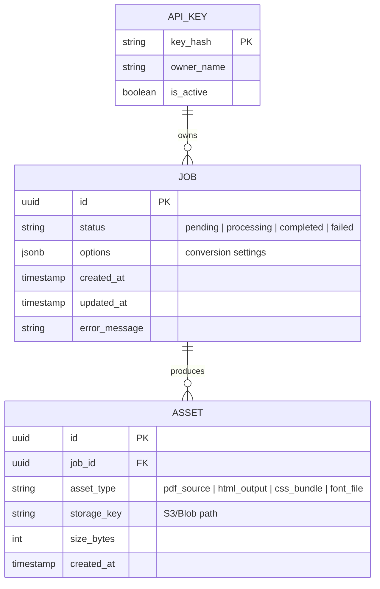

This specification defines the **API Contracts** and underlying **Data Models** for the **Oxidized Document Engine (ODE)**. It focuses on the lifecycle of a document conversion job, from ingestion to high-fidelity HTML output.

---

## 1. Data Architecture Overview

The ODE follows an asynchronous job-processing pattern. Metadata is persisted in **PostgreSQL**, while transient task states and coordination are handled via **Redis**.

### 1.1 Entity Relationship Diagram (ERD)



---

## 2. Schema Changes (PostgreSQL)

### 2.1 Table Definitions

| Table Name | Column | Type | Constraints | Default |
| :--- | :--- | :--- | :--- | :--- |
| **jobs** | id | UUID | PRIMARY KEY | gen_random_uuid() |
| | status | VARCHAR(20) | NOT NULL | 'pending' |
| | options | JSONB | NOT NULL | '{}' |
| | created_at | TIMESTAMPTZ | NOT NULL | NOW() |
| | updated_at | TIMESTAMPTZ | NOT NULL | NOW() |
| | error_log | TEXT | NULL | - |
| **assets** | id | UUID | PRIMARY KEY | gen_random_uuid() |
| | job_id | UUID | FK (jobs.id) ON DELETE CASCADE | - |
| | asset_type | VARCHAR(30) | NOT NULL | - |
| | storage_key | TEXT | NOT NULL | - |
| | mime_type | VARCHAR(50) | NOT NULL | - |

### 2.2 Indexes
- `CREATE INDEX idx_jobs_status ON jobs(status);` (Optimizes worker polling)
- `CREATE INDEX idx_assets_job_id ON assets(job_id);` (Optimizes asset cleanup)

### 2.3 Migration SQL (PostgreSQL)

```sql
-- Up Migration
CREATE TYPE job_status AS ENUM ('pending', 'processing', 'completed', 'failed');

CREATE TABLE jobs (
    id UUID PRIMARY KEY DEFAULT gen_random_uuid(),
    status job_status NOT NULL DEFAULT 'pending',
    options JSONB NOT NULL DEFAULT '{}'::jsonb,
    error_log TEXT,
    created_at TIMESTAMPTZ NOT NULL DEFAULT NOW(),
    updated_at TIMESTAMPTZ NOT NULL DEFAULT NOW()
);

CREATE TABLE assets (
    id UUID PRIMARY KEY DEFAULT gen_random_uuid(),
    job_id UUID NOT NULL REFERENCES jobs(id) ON DELETE CASCADE,
    asset_type VARCHAR(50) NOT NULL,
    storage_key TEXT NOT NULL,
    mime_type VARCHAR(100) NOT NULL,
    size_bytes BIGINT NOT NULL,
    created_at TIMESTAMPTZ NOT NULL DEFAULT NOW()
);

-- Down Migration
DROP TABLE assets;
DROP TABLE jobs;
DROP TYPE job_status;
```

---

## 3. API Endpoints

### 3.1 Create Conversion Job
`POST /v1/jobs`
Submit a PDF for conversion.

**Request Schema (Multipart/Form-Data):**
- `file`: Binary (PDF)
- `options`: JSON String (See below)

```json
{
  "type": "object",
  "properties": {
    "zoom": { "type": "number", "default": 1.5 },
    "embed_css": { "type": "boolean", "default": true },
    "split_pages": { "type": "boolean", "default": false },
    "dest_format": { "type": "string", "enum": ["html", "wasm-bundle"] }
  }
}
```

**Response Schema (202 Accepted):**
```json
{
  "job_id": "550e8400-e29b-41d4-a716-446655440000",
  "status": "pending",
  "links": {
    "self": "/v1/jobs/550e8400-e29b-41d4-a716-446655440000"
  }
}
```

### 3.2 Get Job Status
`GET /v1/jobs/{id}`

**Response Schema (200 OK):**
```json
{
  "id": "uuid",
  "status": "completed",
  "progress": 100,
  "assets": [
    {
      "type": "html_output",
      "url": "/v1/assets/asset-uuid-123",
      "size": 102455
    }
  ],
  "error": null
}
```

---

## 4. Implementation Details (Rust/Axum)

### 4.1 Request DTO (Data Transfer Object)
```rust
#[derive(Deserialize, Serialize, Debug)]
pub struct JobOptions {
    pub zoom: Option<f32>,
    pub embed_css: Option<bool>,
    pub split_pages: Option<bool>,
    pub dest_format: OutputFormat,
}

#[derive(Serialize)]
pub struct JobResponse {
    pub id: uuid::Uuid,
    pub status: JobStatus,
    pub created_at: chrono::DateTime<chrono::Utc>,
}
```

---

## 5. Verification Checklist

### 5.1 Acceptance Criteria
- [ ] **Job Creation**: API accepts multipart PDF uploads up to 50MB.
- [ ] **Data Integrity**: Job metadata is persisted in Postgres before returning `202 Accepted`.
- [ ] **Task Handover**: A job ID is pushed to Redis `task_queue` immediately after DB persistence.
- [ ] **Security**: Files are validated for PDF magic numbers before processing.
- [ ] **Cleanup**: `DELETE /v1/jobs/{id}` removes both DB records and S3/Blob assets.

### 5.2 Test Cases
| Scenario | Input | Expected Outcome |
| :--- | :--- | :--- |
| Valid PDF Upload | `test.pdf`, zoom=2.0 | 202 Accepted, Job ID returned |
| Invalid File Type | `virus.exe` | 400 Bad Request |
| Missing Options | `test.pdf`, null options | 202 Accepted (use defaults) |
| Job Polling | Valid Job ID | 200 OK with current status |
| Non-existent Job | Random UUID | 404 Not Found |

### 5.3 File References
- `src/api/handlers/jobs.rs`: Axum route handlers.
- `src/models/db.rs`: Diesel/SQLx entity definitions.
- `migrations/YYYYMMDD_create_jobs.sql`: Postgres schema.
- `src/api/schemas/job_request.json`: JSON Schema for validation.

### 5.4 Dependencies
1. **Infrastructure**: PostgreSQL 15+ and Redis 7+ must be reachable.
2. **Storage**: AWS S3 bucket (or MinIO for dev) must be configured for asset persistence.
3. **Upstream**: Rust worker service (`ode-worker`) must be listening to the Redis queue.

### 5.5 Verification Steps
1. Run migrations: `sqlx migrate run`.
2. Start the Axum server: `cargo run`.
3. Execute curl test:
   ```bash
   curl -X POST http://localhost:8080/v1/jobs \
     -F "file=@sample.pdf" \
     -F "options={\"zoom\": 1.2}"
   ```
4. Verify record in DB: `SELECT * FROM jobs WHERE id = '<returned_id>';`
5. Verify Redis entry: `LPOP task_queue`.