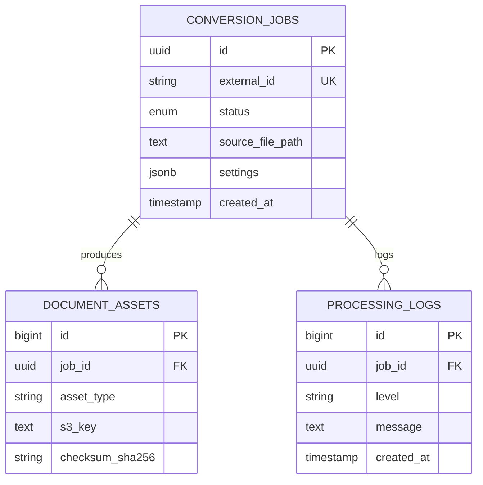

# Data Specification: Data Migration Plan (Legacy to ODE)

This document outlines the migration strategy for transitioning from legacy `pdf2htmlEX` metadata and file storage to the **Oxidized Document Engine (ODE)** PostgreSQL and Redis architecture.

## 1. Target Schema Definition (PostgreSQL)

The target schema is designed for high-concurrency async processing using Rust (`sqlx`) and PostgreSQL.

### 1.1 Table: `conversion_jobs`
Tracks the lifecycle of a PDF-to-HTML transformation.

| Column | Type | Constraints | Default |
| :--- | :--- | :--- | :--- |
| `id` | `UUID` | PRIMARY KEY | `gen_random_uuid()` |
| `external_id` | `VARCHAR(255)` | UNIQUE, NOT NULL | - |
| `status` | `job_status` | ENUM (pending, processing, completed, failed) | 'pending' |
| `source_file_path` | `TEXT` | NOT NULL | - |
| `settings_json` | `JSONB` | NOT NULL | '{}' |
| `priority` | `INT2` | NOT NULL | 10 |
| `created_at` | `TIMESTAMPTZ` | NOT NULL | `NOW()` |
| `updated_at` | `TIMESTAMPTZ` | NOT NULL | `NOW()` |
| `completed_at` | `TIMESTAMPTZ` | NULL | - |

**Indexes:**
- `idx_jobs_status_priority`: `(status, priority DESC)` - For the task fetcher.
- `idx_jobs_external_id`: `HASH` - For API lookups.

### 1.2 Table: `document_assets`
Stores references to the generated Wasm-compatible HTML, CSS, and SVG chunks.

| Column | Type | Constraints | Default |
| :--- | :--- | :--- | :--- |
| `id` | `BIGSERIAL` | PRIMARY KEY | - |
| `job_id` | `UUID` | FK (conversion_jobs.id) ON DELETE CASCADE | - |
| `asset_type` | `VARCHAR(50)` | NOT NULL (html, css, font, svg) | - |
| `s3_key` | `TEXT` | NOT NULL | - |
| `checksum_sha256` | `CHAR(64)` | NOT NULL | - |
| `size_bytes` | `BIGINT` | NOT NULL | - |

### 1.3 Mermaid Entity Relationship Diagram



---

## 2. Migration SQL (DDL)

```sql
-- 001_initial_schema.sql

DO $$ BEGIN
    CREATE TYPE job_status AS ENUM ('pending', 'processing', 'completed', 'failed');
EXCEPTION
    WHEN duplicate_object THEN null;
END $$;

CREATE TABLE IF NOT EXISTS conversion_jobs (
    id UUID PRIMARY KEY DEFAULT gen_random_uuid(),
    external_id VARCHAR(255) UNIQUE NOT NULL,
    status job_status NOT NULL DEFAULT 'pending',
    source_file_path TEXT NOT NULL,
    settings_json JSONB NOT NULL DEFAULT '{}',
    priority SMALLINT NOT NULL DEFAULT 10,
    created_at TIMESTAMPTZ NOT NULL DEFAULT NOW(),
    updated_at TIMESTAMPTZ NOT NULL DEFAULT NOW(),
    completed_at TIMESTAMPTZ
);

CREATE TABLE IF NOT EXISTS document_assets (
    id BIGSERIAL PRIMARY KEY,
    job_id UUID NOT NULL REFERENCES conversion_jobs(id) ON DELETE CASCADE,
    asset_type VARCHAR(50) NOT NULL,
    s3_key TEXT NOT NULL,
    checksum_sha256 CHAR(64) NOT NULL,
    size_bytes BIGINT NOT NULL,
    created_at TIMESTAMPTZ NOT NULL DEFAULT NOW()
);

CREATE INDEX idx_jobs_status_priority ON conversion_jobs (status, priority DESC);
```

---

## 3. Data Migration Strategy

### 3.1 Extraction (Source: Legacy File System/Logs)
Since legacy `pdf2htmlEX` often lacks a structured DB, the migration script will crawl the legacy output directory.
- **Path Pattern**: `/legacy/storage/{job_id}/`
- **Metadata**: Extracted from legacy `.info` or `.json` files if available, otherwise inferred from file timestamps.

### 3.2 Transformation (Rust Migration Tool)
A dedicated Rust binary `ode-migrator` will be used to ensure memory safety during large-scale data movement.

```rust
// Logic snippet for mapping legacy data
match legacy_status {
    "SUCCESS" => TargetStatus::Completed,
    "ERROR" => TargetStatus::Failed,
    _ => TargetStatus::Pending,
}
```

### 3.3 Loading (PostgreSQL & Redis)
1. **PostgreSQL**: Bulk insert into `conversion_jobs`.
2. **Redis**: Hydrate the "Recent Jobs" cache for the React UI.
   - Key: `ode:cache:recent_jobs`
   - Type: `ZSET` (Score = timestamp)

---

## 4. API Endpoints for Migration Support

### Endpoint: POST `/api/v1/internal/migrate`
Used by the migrator tool to push legacy records.

**Request Schema:**
```json
{
  "legacy_id": "string",
  "file_path": "string",
  "timestamp": "ISO8601 String",
  "assets": [
    { "type": "html", "path": "s3://bucket/path/to.html" }
  ]
}
```

**Response Schema:**
```json
{
  "new_uuid": "uuid",
  "status": "imported"
}
```

---

## 5. Verification Checklist & Test Cases

### 5.1 Verification Checklist
- [ ] **Schema Validation**: Run `sqlx migrate info` to ensure all migrations are applied.
- [ ] **Integrity Check**: Foreign key constraints prevent orphaned `document_assets`.
- [ ] **Reversibility**: `001_initial_schema.down.sql` successfully drops tables and types.
- [ ] **Performance**: Index `idx_jobs_status_priority` reduces task fetch time to < 10ms under 100k rows.

### 5.2 Test Cases

| ID | Scenario | Expected Outcome |
| :--- | :--- | :--- |
| TC-1 | Migrate record with missing assets | Job created with `failed` status; asset table remains empty. |
| TC-2 | Duplicate `external_id` import | Migration script catches `UniqueViolation` and logs skip. |
| TC-3 | Large file checksum validation | `checksum_sha256` in DB matches actual S3 file content. |
| TC-4 | Rollback test | Running `down` script removes all data; `up` script restores schema. |

### 5.3 Acceptance Criteria
1. **Zero Data Loss**: Number of legacy folders processed must match the number of rows in `conversion_jobs`.
2. **Path Resolution**: All `s3_key` entries must be reachable via the ODE API.
3. **Auditability**: Every migrated record must have a `settings_json` field containing `{"migrated": true, "legacy_source": "..."}`.

### 5.4 Dependencies
1. **Pre-requisite**: Terraform deployment of RDS (PostgreSQL 15+) and ElastiCache (Redis 7+).
2. **Pre-requisite**: S3 Bucket permissions configured for the `ode-migrator` IAM role.
3. **Post-requisite**: Update React UI to point to the new Axum API endpoints.

### 5.5 Verification Steps
1. Execute `cargo run --bin ode-migrator -- --dry-run`.
2. Verify log output for potential mapping errors.
3. Execute migration: `cargo run --bin ode-migrator -- --commit`.
4. Run SQL Query: `SELECT status, count(*) FROM conversion_jobs GROUP BY status;` and compare with legacy stats.
5. Perform visual regression test using Playwright on 5 random migrated documents.