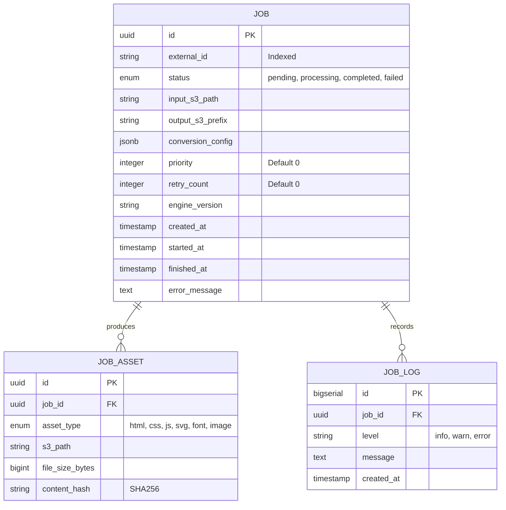

# Data Specification: Oxidized Document Engine (ODE) Schema

**Version**: 1.0.0  
**Status**: Final / Implementable  
**Area**: Job Metadata (PostgreSQL) & Task Queue (Redis)  
**Architect**: Senior Data Architect

---

## 1. Project Overview
The **Oxidized Document Engine (ODE)** requires a robust metadata layer to manage asynchronous PDF-to-HTML conversion jobs. The database must track job lifecycles, configuration parameters, output asset locations (S3), and performance telemetry for the Rust-based core.

---

## 2. Data Architecture Diagram (ERD)



---

## 3. Schema Changes

### 3.1 New Tables

#### Table: `jobs`
Stores the primary metadata and state for every conversion request.

| Column | Type | Constraints | Default |
| :--- | :--- | :--- | :--- |
| `id` | `UUID` | PRIMARY KEY | `gen_random_uuid()` |
| `external_id` | `VARCHAR(255)` | UNIQUE, NOT NULL | - |
| `status` | `job_status_enum` | NOT NULL | `'pending'` |
| `input_s3_path` | `TEXT` | NOT NULL | - |
| `output_s3_prefix` | `TEXT` | NOT NULL | - |
| `conversion_config` | `JSONB` | NOT NULL | `'{}'` |
| `priority` | `INTEGER` | NOT NULL | `0` |
| `retry_count` | `INTEGER` | NOT NULL | `0` |
| `engine_version` | `VARCHAR(50)` | NOT NULL | - |
| `created_at` | `TIMESTAMPTZ` | NOT NULL | `NOW()` |
| `started_at` | `TIMESTAMPTZ` | NULL | - |
| `finished_at` | `TIMESTAMPTZ` | NULL | - |
| `error_message` | `TEXT` | NULL | - |

**Indexes:**
- `idx_jobs_status_priority`: `(status, priority DESC)` - For the worker picker.
- `idx_jobs_external_id`: `(external_id)` - For client lookups.

#### Table: `job_assets`
Tracks individual files generated by the `rust-pdf2html` engine.

| Column | Type | Constraints | Default |
| :--- | :--- | :--- | :--- |
| `id` | `UUID` | PRIMARY KEY | `gen_random_uuid()` |
| `job_id` | `UUID` | FK (jobs.id) ON DELETE CASCADE | - |
| `asset_type` | `asset_type_enum` | NOT NULL | - |
| `s3_path` | `TEXT` | NOT NULL | - |
| `file_size_bytes` | `BIGINT` | NOT NULL | - |
| `content_hash` | `VARCHAR(64)` | NOT NULL | - |

---

### 3.2 Migration SQL (PostgreSQL)

```sql
-- Up Migration
CREATE TYPE job_status_enum AS ENUM ('pending', 'processing', 'completed', 'failed');
CREATE TYPE asset_type_enum AS ENUM ('html', 'css', 'js', 'svg', 'font', 'image');

CREATE TABLE jobs (
    id UUID PRIMARY KEY DEFAULT gen_random_uuid(),
    external_id VARCHAR(255) UNIQUE NOT NULL,
    status job_status_enum NOT NULL DEFAULT 'pending',
    input_s3_path TEXT NOT NULL,
    output_s3_prefix TEXT NOT NULL,
    conversion_config JSONB NOT NULL DEFAULT '{}',
    priority INTEGER NOT NULL DEFAULT 0,
    retry_count INTEGER NOT NULL DEFAULT 0,
    engine_version VARCHAR(50) NOT NULL,
    created_at TIMESTAMPTZ NOT NULL DEFAULT NOW(),
    started_at TIMESTAMPTZ,
    finished_at TIMESTAMPTZ,
    error_message TEXT
);

CREATE INDEX idx_jobs_status_priority ON jobs (status, priority DESC) WHERE status = 'pending';
CREATE INDEX idx_jobs_external_id ON jobs (external_id);

CREATE TABLE job_assets (
    id UUID PRIMARY KEY DEFAULT gen_random_uuid(),
    job_id UUID NOT NULL REFERENCES jobs(id) ON DELETE CASCADE,
    asset_type asset_type_enum NOT NULL,
    s3_path TEXT NOT NULL,
    file_size_bytes BIGINT NOT NULL,
    content_hash VARCHAR(64) NOT NULL,
    created_at TIMESTAMPTZ NOT NULL DEFAULT NOW()
);

-- Down Migration
DROP TABLE IF EXISTS job_assets;
DROP TABLE IF EXISTS jobs;
DROP TYPE IF EXISTS asset_type_enum;
DROP TYPE IF EXISTS job_status_enum;
```

---

## 4. Redis Data Structures
Redis is used for the high-throughput task queue and short-term caching.

- **Task Queue**: `ode:jobs:queue` (Redis List)
  - *Value*: `job_id` (UUID string)
- **Active Workers**: `ode:workers:active` (Redis Hash)
  - *Key*: `worker_id`, *Value*: `last_heartbeat_timestamp`
- **Job Progress Cache**: `ode:job:progress:{job_id}` (Redis String)
  - *Value*: Percentage (0-100)
  - *TTL*: 1 Hour

---

## 5. API Endpoints

### POST `/v1/jobs`
**Request Schema**:
```json
{
  "external_id": "req_99283",
  "input_s3_path": "s3://inbox/doc.pdf",
  "config": {
    "zoom": 1.5,
    "embed_fonts": true,
    "format": "html5"
  },
  "priority": 10
}
```

**Response Schema (202 Accepted)**:
```json
{
  "job_id": "550e8400-e29b-41d4-a716-446655440000",
  "status": "pending",
  "links": {
    "self": "/v1/jobs/550e8400-e29b-41d4-a716-446655440000"
  }
}
```

---

## 6. Verification Checklist & Implementation Plan

### 6.1 Acceptance Criteria
- [ ] **Schema Integrity**: PostgreSQL schema allows `JSONB` for flexible configuration without data loss.
- [ ] **Performance**: Index `idx_jobs_status_priority` returns the next job in `< 5ms` with 1 million rows.
- [ ] **Safety**: `ON DELETE CASCADE` correctly removes assets when a job is deleted.
- [ ] **Observability**: `engine_version` is captured to correlate bugs with specific Rust core releases.

### 6.2 Test Cases
| ID | Scenario | Expected Outcome |
| :--- | :--- | :--- |
| TC-1 | Insert job with duplicate `external_id` | DB throws Unique Constraint Violation. |
| TC-2 | Update job status to 'processing' | `started_at` timestamp is updated via application logic. |
| TC-3 | Rollback migration | All tables and custom types are removed cleanly. |
| TC-4 | Large Config | `conversion_config` handles 50KB of JSON settings. |

### 6.3 File References
- `infra/migrations/001_initial_schema.sql`: PostgreSQL migration.
- `src/db/models.rs`: Rust structs for Diesel/SQLx mapping.
- `src/queue/redis_client.rs`: Redis task push/pop logic.

### 6.4 Dependencies
1. **Pre-requisite**: AWS S3 Bucket creation (Terraform).
2. **Post-requisite**: Rust Worker implementation to consume the `ode:jobs:queue`.

### 6.5 Verification Steps
1. Execute `sqlx migrate run` (or equivalent).
2. Run `\dt` in psql to verify tables.
3. Execute `EXPLAIN ANALYZE SELECT id FROM jobs WHERE status = 'pending' ORDER BY priority DESC LIMIT 1;` to verify index usage.
4. Verify Redis connectivity via `redis-cli ping`.