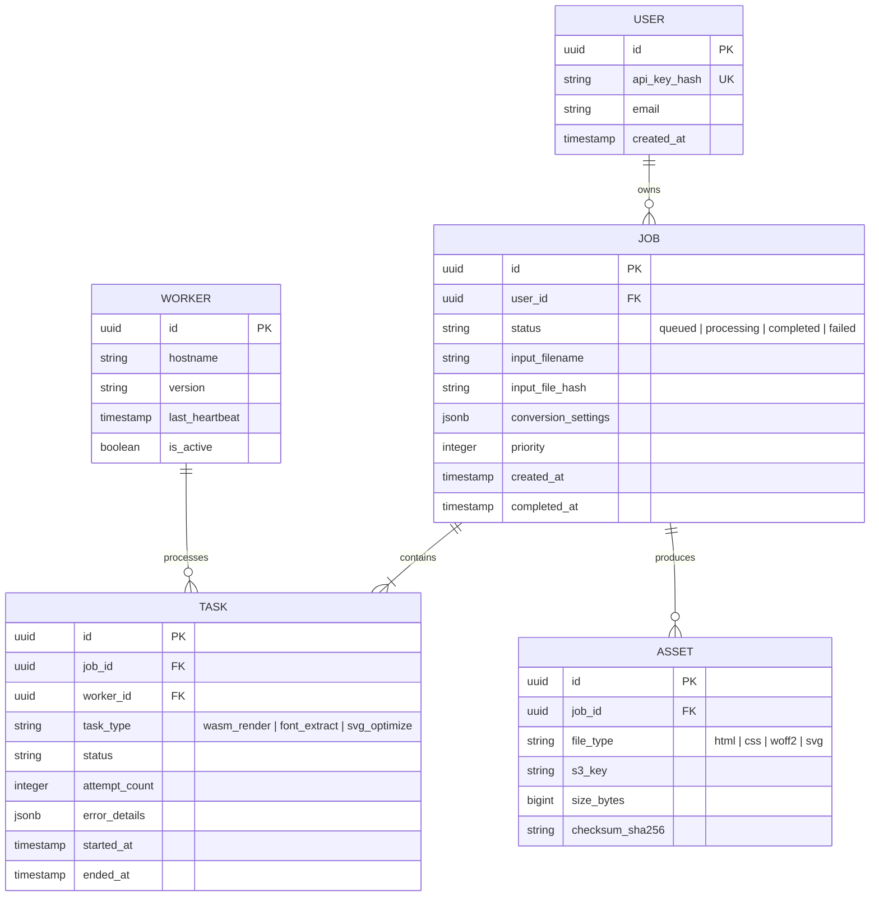

# Data Specification: Entity Relationship Diagram (ERD)
**Project:** Oxidized Document Engine (ODE)
**Version:** 1.0.0
**Status:** Finalized for Implementation

---

## 1. Executive Summary
The Oxidized Document Engine (ODE) requires a robust relational schema to manage the lifecycle of high-fidelity document conversions. This specification defines the PostgreSQL schema for job metadata and the Redis structure for real-time task orchestration.

## 2. Entity Relationship Diagram (ERD)



---

## 3. Schema Changes (PostgreSQL)

### 3.1 Table: `users`
| Column | Type | Constraints | Default |
| :--- | :--- | :--- | :--- |
| `id` | UUID | PRIMARY KEY | gen_random_uuid() |
| `api_key_hash` | TEXT | UNIQUE, NOT NULL | - |
| `email` | TEXT | UNIQUE, NOT NULL | - |
| `created_at` | TIMESTAMPTZ | NOT NULL | NOW() |

**Indexes:** `idx_users_api_key` (B-Tree on api_key_hash).

### 3.2 Table: `jobs`
| Column | Type | Constraints | Default |
| :--- | :--- | :--- | :--- |
| `id` | UUID | PRIMARY KEY | gen_random_uuid() |
| `user_id` | UUID | FK (users.id) | - |
| `status` | VARCHAR(20) | NOT NULL | 'queued' |
| `input_file_hash` | CHAR(64) | NOT NULL | - |
| `conversion_settings`| JSONB | NOT NULL | '{}' |
| `priority` | INT | NOT NULL | 0 |

**Indexes:** `idx_jobs_status` (Hash), `idx_jobs_user_id` (B-Tree).

### 3.3 Table: `tasks`
| Column | Type | Constraints | Default |
| :--- | :--- | :--- | :--- |
| `id` | UUID | PRIMARY KEY | - |
| `job_id` | UUID | FK (jobs.id) ON DELETE CASCADE | - |
| `worker_id` | UUID | FK (workers.id) | - |
| `task_type` | VARCHAR(30) | NOT NULL | - |
| `attempt_count` | INT | NOT NULL | 0 |

### 3.4 Migration SQL
```sql
-- Migration: 20231027_initial_schema.sql
CREATE TYPE job_status AS ENUM ('queued', 'processing', 'completed', 'failed');

CREATE TABLE users (
    id UUID PRIMARY KEY DEFAULT gen_random_uuid(),
    api_key_hash TEXT UNIQUE NOT NULL,
    email TEXT UNIQUE NOT NULL,
    created_at TIMESTAMPTZ DEFAULT NOW()
);

CREATE TABLE jobs (
    id UUID PRIMARY KEY DEFAULT gen_random_uuid(),
    user_id UUID REFERENCES users(id),
    status job_status DEFAULT 'queued',
    input_filename TEXT NOT NULL,
    input_file_hash CHAR(64) NOT NULL,
    conversion_settings JSONB DEFAULT '{}',
    priority INTEGER DEFAULT 0,
    created_at TIMESTAMPTZ DEFAULT NOW(),
    completed_at TIMESTAMPTZ
);

CREATE TABLE workers (
    id UUID PRIMARY KEY DEFAULT gen_random_uuid(),
    hostname TEXT NOT NULL,
    version TEXT NOT NULL,
    last_heartbeat TIMESTAMPTZ DEFAULT NOW(),
    is_active BOOLEAN DEFAULT TRUE
);

CREATE TABLE tasks (
    id UUID PRIMARY KEY DEFAULT gen_random_uuid(),
    job_id UUID REFERENCES jobs(id) ON DELETE CASCADE,
    worker_id UUID REFERENCES workers(id),
    task_type TEXT NOT NULL,
    status TEXT NOT NULL,
    attempt_count INTEGER DEFAULT 0,
    error_details JSONB,
    started_at TIMESTAMPTZ,
    ended_at TIMESTAMPTZ
);

CREATE TABLE assets (
    id UUID PRIMARY KEY DEFAULT gen_random_uuid(),
    job_id UUID REFERENCES jobs(id) ON DELETE CASCADE,
    file_type TEXT NOT NULL,
    s3_key TEXT NOT NULL,
    size_bytes BIGINT NOT NULL,
    checksum_sha256 CHAR(64) NOT NULL
);
```

---

## 4. Redis Data Structures (Task Queue & Cache)

| Key Pattern | Type | Purpose | TTL |
| :--- | :--- | :--- | :--- |
| `job:queue:{priority}` | List | FIFO queue for pending job IDs | None |
| `job:cache:{file_hash}` | String | Maps file hash to existing Job ID for de-duplication | 24h |
| `worker:heartbeat:{id}` | String | Stores worker status for health checks | 60s |
| `active:tasks:{worker_id}`| Set | List of Task IDs currently held by a worker | None |

---

## 5. API Endpoints

### 5.1 Submit Job
- **Endpoint**: `POST /api/v1/jobs`
- **Request Schema**:
```json
{
  "file_id": "uuid",
  "settings": {
    "zoom": 1.5,
    "embed_fonts": true,
    "format": "html"
  },
  "priority": 10
}
```
- **Response Schema**:
```json
{
  "job_id": "uuid",
  "status": "queued",
  "estimated_wait_ms": 4500
}
```

---

## 6. Verification Checklist

### Acceptance Criteria
- [ ] **Data Integrity**: Foreign keys must prevent deletion of a User if active Jobs exist.
- [ ] **Performance**: `idx_jobs_status` must allow sub-10ms lookups for the scheduler.
- [ ] **Atomicity**: Job status updates and Task creation must occur within a single Postgres transaction.
- [ ] **Auditability**: Every task failure must populate `error_details` in the `tasks` table.

### Test Cases
| ID | Scenario | Expected Outcome |
| :--- | :--- | :--- |
| TC-01 | Submit duplicate file hash | API returns existing Job ID (Cache hit). |
| TC-02 | Worker process crash | Task status remains 'processing'; Watchdog re-queues after heartbeat timeout. |
| TC-03 | Delete Job | Cascading delete removes all associated Tasks and Asset metadata. |

### File References
- `migrations/*.sql`: Database evolution scripts.
- `src/models/db.rs`: Diesel/SQLx entity definitions.
- `src/queue/redis.rs`: Redis interaction logic.

### Dependencies
1. **Pre-requisite**: AWS S3 Bucket configuration for Asset storage.
2. **Pre-requisite**: PostgreSQL 15+ instance with `pgcrypto` enabled.
3. **Post-requisite**: Worker nodes must implement the Heartbeat protocol defined in Section 4.

### Verification Steps
1. Run `sqlx migrate run` (or equivalent) to apply schema.
2. Execute `cargo test --test integration_db_tests` to verify FK constraints.
3. Use `redis-cli MONITOR` during a job submission to verify queue push logic.
4. Verify Prometheus metrics capture `db_connection_pool_active` counts.